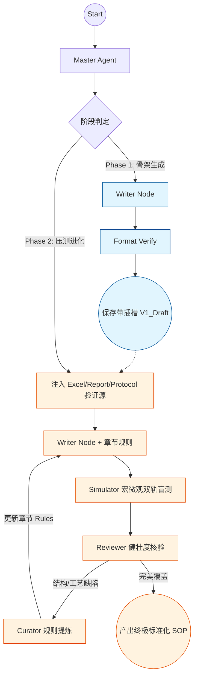

# SOP 生成系统 V6 - DeepLang (两阶段演进版)

基于 LangGraph 的“压测进化型” SOP 自动生成系统。

## 🎯 系统概述

**DeepLang V6** 抛弃了传统的“单次生成”模式，引入了业界领先的**两阶段解耦架构**：

- **阶段一：形式导向生成 (Phase 1)** - 屏蔽复杂数据，利用 Protocol/Report 快速构建带 `[XXX]` 插槽的泛化 SOP 骨架，解决 LLM 幻觉问题。
- **阶段二：数据盲测进化 (Phase 2)** - 接入真实 Excel 数据进行“压力测试”。通过 Simulator 模拟执行与专家节点比对，倒逼 SOP 结构进化并沉淀章节级规则库。

## 📁 核心资源包结构 (Resource Pack)

系统产出的资产实现绝对的“脑机分离”：

```text
sop_resource_pack/
├── 1_memory_skills/       # 【大脑层】Agent 节点的生存技能 (.md)
│   ├── master_skill.md    # 统筹与分发
│   ├── writer_skill.md    # 写作底座与插槽铁律
│   ├── simulator_skill.md # 宏微观双轨模拟压测
│   ├── review_skill.md    # 结构/流程覆盖度审计
│   └── curator_skill.md   # 规则提炼与记忆固化
├── 2_chapter_rules/       # 【经验层】从 Phase 2 失败中学习到的章节细则 (.json)
├── 3_sandbox_scripts/     # 【工具层】Excel 解析沙盒与映射脚本 (.py)
└── 4_sop_template/        # 【产物层】唯一交付的极致泛化 SOP 模板 (.md)
```

## 🚀 工作流程 (LangGraph)



## 🧠 核心技术内涵

1. **双轨盲测 (Double-Blind Testing)**：Simulator 既拿着 Excel 试填插槽（微观），又拿着 SOP 尝试盲写实验报告（宏观），全方位暴露 SOP 的描述死角。
2. **章节专家进化**：Curator 不再修改全局 Skill，而是针对特定章节生成 `.json` 细则，让系统跑的项目越多，对特定章节（如精密度、稳定性）的“直觉”越敏锐。
3. **强制插槽制**：禁止 AI 编造任何不确定的数值，所有变动点必须以 `[XXX]` 占位符体现，确保 SOP 的纯粹泛化性。

## 🔧 快速开始

### 1. 环境准备
```bash
git clone ...
pip install -r requirements.txt
cp .env.example .env # 填入 Grok & Gemini API Key
```

### 2. 执行流程
- **执行第一阶段**：在 `main.py` 中设置 `phase=1`，产出初始骨架初稿。
- **执行第二阶段**：将 Excel 数据放入 `mockData/`，设置 `phase=2`，对骨架进行极限压测。

## 📝 开发者说明
- **代码重构**：所有文件已移除 `_v6` 后缀，由 Git 负责版本管理。
- **项目文档**：详尽的设计方案请参考 `docs/architecture_proposal.md`。

---
*Powered by DeepLang Team - 致力于构建最具工业美感的 GLP 数字化工具*
