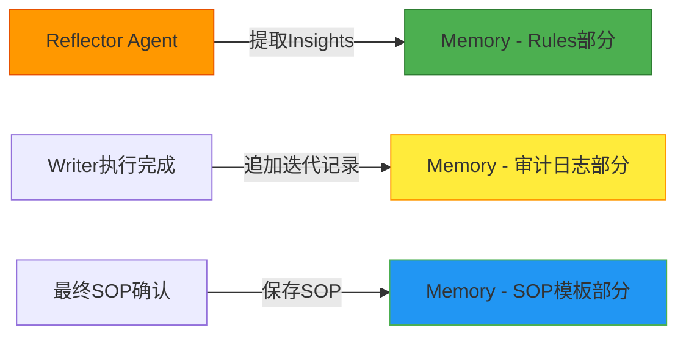

# DeepAgent 架构需求分析

## 📋 目录

1. [核心架构概述](#核心架构概述)
2. [系统组件详解](#系统组件详解)
3. [数据流设计](#数据流设计)
4. [核心类定义](#核心类定义)
5. [Prompt设计规范](#prompt设计规范)
6. [工作流程说明](#工作流程说明)
7. [技术实现要点](#技术实现要点)
8. [文件结构](#文件结构)
9. [测试策略](#测试策略)

---

## 核心架构概述

### 设计理念

本项目实现一个**基于自然语言驱动的自主多Agent协作系统**，用于SOP生成任务。

### 核心特点

1. **通用Agent框架**：`DeepAgent`作为基础类，通过不同的`system_prompt`实现不同职能
2. **子Agent协作**：三个专业子Agent（writer/simulator/reviewer）协同工作
3. **主Agent协调**：`main_agent`负责任务理解、动态调度子Agent
4. **持久化记忆**：`memory.md`存储经验，支持读写
5. **学习闭环**：reflector提取insight，curator更新memory

### 与现有架构的区别

| 维度 | Workflow架构 | ACE系统 | **本架构(DeepAgent)** |
|-------|------------|---------|-------------------|
| 流程驱动 | 硬编码图 | 内部自动协调 | **主Agent自主决策** |
| 子Agent | 预定义节点 | Generator/Reflector/Curator | **writer/simulator/reviewer** |
| 记忆管理 | StateGraph | JSON文件 | **memory.md文件** |
| 学习机制 | 无 | Reflector+Curator内部 | **外部Reflector+Curator** |
| 决策方式 | 固定路由 | 内部自动迭代 | **自然语言自主规划** |

---

## 系统组件详解

### 1. DeepAgent 基础类

#### 职责
- LLM调用的通用封装
- 管理API配置（provider/model/temperature）
- 统一的输入输出接口

#### 核心方法

```python
class DeepAgent:
    def __init__(self, system_prompt: str, llm_config: Dict[str, Any]):
        """
        初始化Agent

        Args:
            system_prompt: 系统提示词，定义Agent的职责和行为
            llm_config: LLM配置（api_provider, model, temperature, max_tokens）
        """
        self.system_prompt = system_prompt
        self.llm_config = llm_config
        self.client = self._init_llm_client()

    def run(self, query: str) -> str:
        """
        执行Agent任务

        Args:
            query: 用户查询或任务描述

        Returns:
            LLM的响应文本
        """
        messages = [
            {"role": "system", "content": self.system_prompt},
            {"role": "user", "content": query}
        ]

        response = self.client.chat.completions.create(
            model=self.llm_config["model"],
            messages=messages,
            temperature=self.llm_config["temperature"],
            max_tokens=self.llm_config["max_tokens"]
        )

        return response.choices[0].message.content
```

---

### 2. SubAgent 定义

#### 2.1 Writer Agent

**职责**：
- 根据protocol和report生成SOP
- 逆向思考：从target内容推导规则
- 输出结构化的SOP（三大段规则）

**输入**：
- `original_content`: 原始protocol内容
- `target_generate_content`: 目标report内容
- `section_title`: 章节标题
- `memory`: 相关经验（从memory.md查询）

**输出**：
```json
{
  "sop_type": "rule_template | simple_insert | complex_composite",
  "current_sop": "核心填写规则：...\n\n通用模板：...\n\n标准示例：...",
  "reasoning": "我如何从原始内容推导出SOP的",
  "confidence": 0.85
}
```

**System Prompt设计**：
```
你是SOP Writer，负责从原始protocol和目标report中提炼标准化操作规程。

你的任务：
1. 分析original_content和target_generate_content的差异
2. 逆向推导出将原始内容转换为目标内容所需的规则
3. 提炼出通用的填写规则、模板和示例

输出格式：
- sop_type: 判断SOP类型
- current_sop: 结构化的三大段规则
- reasoning: 你的推导过程

注意事项：
- 如果有memory中的相关经验，优先参考
- 规则要具体、可执行
- 模板要通用化
```

---

#### 2.2 Simulator Agent

**职责**：
- 模拟执行SOP（盲测）
- 根据SOP从original_content生成内容
- **绝对不能看到target_generate_content**（防泄露）

**输入**：
- `section_title`: 章节标题
- `original_content`: 原始protocol内容
- `current_sop`: Writer生成的SOP

**输出**：
```json
{
  "simulated_generate_content": "根据SOP生成的内容",
  "reasoning": "我如何应用SOP的每条规则的",
  "steps_taken": ["步骤1", "步骤2", "步骤3"]
}
```

**System Prompt设计**：
```
你是SOP Simulator，负责测试SOP的可执行性。

你的任务：
1. 严格遵循current_sop中的规则
2. 从original_content中提取信息
3. 生成符合SOP要求的内容

关键约束：
- 你只能看到original_content和current_sop
- 绝对不能参考target_generate_content（这是盲测）
- 必须按SOP规则逐步执行

输出：
- simulated_generate_content: 生成的内容
- reasoning: 你如何应用每条规则的
- steps_taken: 执行的步骤
```

---

#### 2.3 Reviewer Agent

**职责**：
- 对比simulated内容和target内容
- 给出通过/失败的判断
- 提供详细的feedback

**输入**：
- `simulated_generate_content`: Simulator生成的内容
- `target_generate_content`: 目标report内容
- `original_sop`: 使用的SOP规则

**输出**：
```json
{
  "is_passed": true/false,
  "status": "PASSED | FAILED",
  "feedback": {
    "format_issues": ["格式问题列表"],
    "content_issues": ["内容问题列表"],
    "missing_elements": ["缺失的元素列表"],
    "overall_score": 4.5
  },
  "suggestions": ["改进建议列表"]
}
```

**System Prompt设计**：
```
你是SOP Reviewer，负责评估SOP的质量。

你的任务：
1. 严格对比simulated内容和target内容
2. 识别格式、内容、完整性问题
3. 给出具体的改进建议

评估维度：
- 格式：表格、标题、排版是否正确
- 内容：关键信息是否准确提取
- 完整性：是否有遗漏

输出：
- is_passed: 是否通过
- feedback: 详细的问题列表
- overall_score: 质量分数（0-5）
- suggestions: 改进建议
```

---

### 3. Main Agent

**职责**：
- 理解用户的自然语言任务
- 自主规划执行步骤
- 动态调度子Agent
- 记录完整的trajectory

**核心方法**：

```python
class MainAgent(DeepAgent):
    def __init__(self, subagents: List[DeepAgent], memory_path: str):
        self.subagents = {agent.name: agent for agent in subagents}
        self.memory_path = memory_path
        super().__init__(self._get_main_prompt(), llm_config)

    def run(self, query: str) -> Dict[str, Any]:
        """
        执行主任务并生成trajectory

        Args:
            query: 任务描述

        Returns:
            {
                "trajectory": [完整执行轨迹],
                "final_result": "最终结果",
                "summary": "总结"
            }
        """
        # 1. 加载memory
        memory = self._load_memory()

        # 2. 理解任务并规划
        planning_query = f"""
        任务：{query}
        可用经验：{memory}

        请规划如何完成这个任务。
        可用的子Agent：
        - writer: 生成SOP
        - simulator: 测试SOP
        - reviewer: 评估质量

        输出你的执行计划（JSON格式）：
        {{
            "understanding": "你如何理解任务",
            "steps": [
                {{"agent": "writer", "params": {...}}},
                {{"agent": "simulator", "params": {...}}},
                {{"agent": "reviewer", "params": {...}}}
            ]
        }}
        """

        plan = self._parse_plan(super().run(planning_query))

        # 3. 按计划执行并记录trajectory
        trajectory = []
        current_state = {}

        for step in plan["steps"]:
            agent_name = step["agent"]
            agent = self.subagents[agent_name]

            result = agent.run(json.dumps(step["params"], ensure_ascii=False))

            trajectory_entry = {
                "step": len(trajectory) + 1,
                "agent": agent_name,
                "input": step["params"],
                "output": result,
                "timestamp": datetime.now().isoformat()
            }

            trajectory.append(trajectory_entry)

            # 更新current_state供下一步使用
            current_state = json.loads(result)

        # 4. 返回trajectory
        return {
            "trajectory": trajectory,
            "final_result": current_state,
            "query": query,
            "memory_used": memory
        }
```

**System Prompt设计**：
```
你是Main Agent，是整个系统的协调者和决策者。

你的职责：
1. 理解用户的自然语言任务
2. 查询memory获取相关经验
3. 自主规划如何完成任务
4. 调度合适的子Agent
5. 记录完整的执行轨迹

可用的子Agent：
- writer: 生成SOP，需要original_content和target_generate_content
- simulator: 测试SOP，需要current_sop和original_content
- reviewer: 评估质量，需要simulated内容和target内容

工作方式：
- 每次任务都要重新规划
- 不要预设固定的执行流程
- 根据任务动态选择需要的Agent
- 记录每一步的输入、输出、时间戳

输出格式：
- understanding: 任务理解
- steps: 执行步骤列表（agent + params）
```

---

### 4. Reflector Agent

**职责**：
- 分析完整的trajectory
- 提取有价值的insights
- 识别成功的模式和失败的教训

**输入**：
- `trajectory`: Main Agent记录的完整执行轨迹

**输出**：
```json
{
  "insights": [
    {
      "type": "rule_success | rule_failure | problem_solution | pattern_discovery",
      "content": "具体的经验内容",
      "context": "这个经验适用的场景",
      "evidence": "从trajectory中提取的证据",
      "applicability": {
        "sop_types": ["rule_template"],
        "sections": ["验证报告", "GLP声明"],
        "quality_threshold": 4.0
      }
    }
  ],
  "summary": "对本次trajectory的经验总结（自然语言）"
}
```

**System Prompt设计**：
```
你是Reflector Agent，负责从执行轨迹中提取有价值的经验。

你的任务：
分析给定的执行轨迹（trajectory），提取出：
1. 哪些规则/方法是有效的，为什么？
2. 哪些规则/方法是无效的，为什么？
3. 遇到了什么问题，是如何解决的？
4. 有哪些通用化的经验可以复用？

分析维度：
- 规则有效性：哪些SOP规则被证明是有效的
- 质量评估：哪些因素影响了质量
- 迭代效果：迭代是否带来了改进
- 泛化能力：经验是否可以应用到其他场景

输出格式：
- insights: 经验列表，每条包含type, content, context, evidence, applicability
- summary: 自然语言总结
```

---

### 5. Curator Agent

**职责**：
- 整合新的insights到memory
- 去重和清理无效经验
- 维护memory的质量

**输入**：
- `memory`: 当前的memory内容
- `insights`: Reflector提取的新insights

**输出**：
```json
{
  "updated_memory": "更新后的完整memory内容",
  "changes_summary": {
    "added_insights": 5,
    "updated_insights": 3,
    "removed_insights": 1,
    "duplicates_found": 2
  },
  "recommendations": "对memory管理的建议"
}
```

**System Prompt设计**：
```
你是Curator Agent，负责维护和优化经验库。

你的任务：
将新的insights整合到memory中。

更新逻辑：
1. 检查insight是否已存在（内容相似度）
2. 如果存在，合并或更新
3. 如果不存在，作为新经验添加
4. 删除长期无效的经验（如多次被标记为有害的）
5. 优化memory的组织结构

质量原则：
- 避免重复内容
- 维护经验的准确性
- 保留高质量、高价值的insights
- 删除过时或已被证明无效的经验

输出格式：
- updated_memory: 更新后的完整memory
- changes_summary: 变更统计
- recommendations: 管理建议
```

---

### 6. Memory System

#### ⚠️ 重要区分：ACE存储层 vs DeepAgent记忆系统

本项目中有**两套独立的记忆/存储系统**，职责完全不同：

| 维度 | ACE存储层（可复用） | DeepAgent记忆系统（本项目） |
|-------|---------------------|----------------------|
| **核心文件** | `agent_memory/rules/rules.json` | `deepagent/memory.md` |
| **职责** | ACE的"存储层"（playbook） | DeepAgent的"记忆系统" |
| **存储格式** | JSON | Markdown |
| **组织方式** | 类型+章节结构 | 自由文本组织 |
| **维护对象** | Rules（bullet点） | 多种类型insights |
| **更新方式** | Curator自动更新 | Reflector+Curator协同更新 |

---

#### 6.1 ACE存储层（RulesManager）

**文件路径**：`agent_memory/rules/rules.json`

**设计理念**：ACE系统内部的playbook，用于Generator生成时提供相关规则。

##### Rules（RulesManager）
- **文件**：`agent_memory/rules/rules.json`
- **用途**：⭐ **这是ACE的"存储层"核心**
- **内容**：
  - **组织方式**：`<sop_type> -> <chapter_id> -> <rule_id>`
  - **每个Rule**：
    - `id`: 规则唯一标识（rule_xxx）
    - `content`: 规则内容（具体指令）
    - `tags`: 分类标签（"表格", "格式"）
    - `applicability`: 适用场景
    - `metrics`: 帮助/有害/使用计数
      - `helpful`: 帮助次数
      - `harmful`: 有害次数
      - `usage_count`: 总使用次数

**ACE存储层总结**：
- ✅ Rules是真正的"存储层"
- ✅ AuditLog是日常记录
- ✅ SOPTemplates是最终产物保存
- ⚠️ **Curator会自动更新Rules**（ACE内部闭环）

---

#### 6.2 系统记忆存储层

**文件路径**：`deepagent/memory.md`

**设计理念**：自然语言描述的经验库，支持Main Agent查询和Reflector/Curator更新。

##### 块1：审计日志（AuditLog）
- **文件**：`agent_memory/system/audit_log.json`
- **用途**：日常维护和保存
- **内容**：
  - `timestamp`: 何时发生迭代
  - `version`: Version1/2/3
  - `sop`: 生成的SOP内容
  - `sop_id`: SOP唯一标识
  - `sop_type`: SOP类型（rule_template等）
  - `curation`: Curator的修改记录
  - `metrics`: token使用、延迟、模型
  - `quality_assessment`: 质量分数、反馈

##### 块2：SOP模板（SOPTemplates）
- **文件**：`agent_memory/system/sop_templates.json`
- **用途**：日常维护和保存
- **内容**：
  - `templates`: 按SOP type存储模板
  - `chapter_sops`: 按章节存储最终SOP
    - `sop_content`: SOP内容
    - `version`: 版本标识
    - `quality_score`: 质量分数


#### 6.23 DeepAgent记忆系统
**结构设计（Markdown）：

```markdown
# DeepAgent Experience Memory

## Last Updated: 2025-01-15 10:30:00

## 元信息
- Version: 1.0
- Created: 2025-01-01
- Total Insights: 156

---

## Categories

### (1) 审计日志部分（AuditLog）
**用途**：记录轨迹细节、迭代历史、执行统计

#### 章节：验证报告

##### 迭代记录
- **时间**：2025-01-15 09:30:00
- **版本**：Version1
- **迭代次数**：2
- **SOP内容**：核心填写规则：...
- **SOP ID**：sop_001
- **实验类型**：rule_template
- **Curation记录**：无
- **Metrics**：
  - Tokens: 2500
  - Latency: 5.2s
  - Model: gpt-4o
- **质量评估**：
  - Score: 4.2
  - Feedback: "表格格式正确，但缺少示例"

---

### (2) Rules部分（ACE Rules）
**用途**：⭐ 存储可复用的经验规则（DeepAgent的"存储层"）

#### 实验类型分类

##### rule_template类型规则
###### rule-001: 表格格式规范
- **ID**: rule-001
- **内容**：表格必须有表头，表头格式为|字段名|类型|说明|
- **类型**：rule_success
- **适用场景**：
  - SOP Types: rule_template, complex_composite
  - 章节：验证报告, GLP声明
  - 质量阈值：≥ 4.0
- **指标**：
  - Helpful: 10
  - Harmful: 0
  - Usage Count: 15
  - Last Used: 2025-01-14
- **证据**：Version1失败因为没表头，Version2加上表头后通过

###### rule-002: 双语标题处理
- **ID**: rule-002
- **内容**：双语标题必须逐字复制，不得翻译或修改
- **类型**：rule_success
- **适用场景**：
  - SOP Types: simple_insert
  - 章节：GLP声明
- **指标**：
  - Helpful: 8
  - Harmful: 1
  - Usage Count: 12
- **证据**：错误翻译导致内容不一致

##### simple_insert类型规则
...

##### complex_composite类型规则
...

---

### (3) SOP模板部分（SOPTemplates）
**用途**：存储生成的SOP内容和版本

#### 章节存储

##### 验证报告章节
###### rule_template类型SOP
- **SOP内容**：核心填写规则：...\n\n通用模板：...\n\n标准示例：...
- **版本**：Version3
- **质量分数**：4.8
- **生成时间**：2025-01-15

###### simple_insert类型SOP
...

---

## 操作接口

```python
class DeepAgentMemory:
    def __init__(self, file_path: str = "deepagent/memory.md"):
        self.file_path = file_path

    def read(self) -> str:
        """读取完整memory内容"""
        with open(self.file_path, 'r', encoding='utf-8') as f:
            return f.read()

    def write(self, content: str):
        """完整替换memory内容"""
        with open(self.file_path, 'w', encoding='utf-8') as f:
            f.write(content)

    def query_rules(self, sop_type: str, chapter_id: str = "") -> List[str]:
        """
        查询相关规则（类似ACE RulesManager.get_rules）
        
        Args:
            sop_type: SOP类型（rule_template/simple_insert/complex_composite）
            chapter_id: 章节ID（可选，为空则返回该类型的所有规则）
        
        Returns:
            匹配的规则内容列表（自然语言格式）
        """
        # 实现逻辑：从memory中提取相关规则
        # 1. 读取完整memory
        # 2. 解析Rules部分
        # 3. 根据sop_type和chapter_id过滤
        # 4. 返回规则列表
        pass

    def append_insights(self, trajectory_summary: str, new_insights: List[Dict]):
        """
        追加新的insights（Reflector使用）
        
        Args:
            trajectory_summary: 轨迹摘要
            new_insights: Reflector提取的insights列表
        """
        # 实现逻辑：追加到memory的(2)部分
        # 1. 读取当前memory
        # 2. 解析Categories
        # 3. 追加新的insights
        # 4. 保存
        pass

    def log_iteration(self, chapter_id: str, iteration_data: Dict):
        """
        记录迭代信息（类似ACE AuditLog.log_iteration）
        
        Args:
            chapter_id: 章节ID
            iteration_data: {
                "timestamp": "ISO-8601",
                "version": "Version1/2/3",
                "sop": "SOP内容",
                "sop_id": "sop_xxx",
                "sop_type": "rule_template",
                "curation": {...},
                "metrics": {...},
                "quality_assessment": {...}
            }
        """
        # 实现逻辑：追加到memory的(1)部分
        # 1. 找到对应章节
        # 2. 追加新的迭代记录
        # 3. 保存
        pass

    def save_sop(self, chapter_id: str, sop_type: str, sop_content: str, 
                  version: str = "latest", quality_score: float = 0.0):
        """
        保存SOP（类似ACE SOPTemplates.save_sop）
        
        Args:
            chapter_id: 章节ID
            sop_type: SOP类型
            sop_content: SOP内容
            version: 版本标识
            quality_score: 质量分数
        """
        # 实现逻辑：追加到memory的(3)部分
        # 1. 找到对应章节
        # 2. 添加或更新SOP
        # 3. 保存
        pass
```

**操作接口**：

```python
class MemoryManager:
    def __init__(self, file_path: str = "deepagent/memory.md"):
        self.file_path = file_path

    def read(self) -> str:
        """读取memory内容"""
        with open(self.file_path, 'r', encoding='utf-8') as f:
            return f.read()

    def write(self, content: str):
        """写入memory内容"""
        with open(self.file_path, 'w', encoding='utf-8') as f:
            f.write(content)

    def append(self, content: str):
        """追加内容到memory"""
        with open(self.file_path, 'a', encoding='utf-8') as f:
            f.write("\n\n" + content)
```
---

## Main Agent自主决策过程

### 核心特点：自然语言驱动的动态决策

**重要理念**：
- ❌ **不是**固定的步骤顺序（先调用writer，再调用simulator，再调用reviewer）
- ✅ **而是**Main Agent根据任务理解**自主决定**调用哪些Agent、什么顺序、传什么参数

---

### 决策示例

#### 示例1：简单SOP生成任务

```
用户输入："为验证报告章节生成一个SOP"

Main Agent的自主决策过程：
1. 理解任务：需要生成SOP，不需要迭代
2. 查询memory：检查是否有相关经验
3. 决策策略：
   - 如果有相关Rules → 传给Writer Agent
   - 如果没有相关Rules → Writer Agent自行决策
4. 执行计划：仅调用Writer Agent一次
5. 记录trajectory：单步决策记录
```

#### 示例2：带迭代的SOP生成任务

```
用户输入："生成5个章节SOP，进行3轮迭代优化"

Main Agent的自主决策过程：
1. 理解任务：需要多章节、需要质量保证
2. 查询memory：获取相关Rules和迭代模式
3. 决策策略：
   - 对每个章节：规划Writer→Simulator→Reviewer循环
   - 最多3轮迭代
   - 每轮Review后，根据结果决定重试还是进入下一章节
4. 动态执行：根据Review结果实时调整策略
5. 记录trajectory：完整的多步决策记录
```

#### 示例3：仅查询任务

```
用户输入："查看memory中有哪些表格格式相关的Rules"

Main Agent的自主决策过程：
1. 理解任务：不需要执行，只需查询
2. 查询memory：从Rules部分提取相关内容
3. 决策策略：
   - 不调用任何sub-agent
   - 直接返回查询结果
4. 返回答案：自然语言总结
```

---

### 决策记录格式

```markdown
## Trajectory记录

### 决策步骤 1：任务理解
**时间**：2025-01-15 10:30:00
**Agent**：Main Agent
**输入**：
- 用户任务："为验证报告章节生成SOP"
- Memory查询：3条相关Rules
**决策**：识别到任务类型为"单次SOP生成"，无需迭代
**行动**：规划调用Writer Agent一次
**推理**："用户只要求生成，没有提到需要验证或优化"

### 决策步骤 2：Writer执行
**时间**：2025-01-15 10:31:00
**Agent**：Writer Agent
**输入**：
- Original Content：protocol内容...
- Target Content：report内容...
- Memory Rules：3条相关规则（rule-001, rule-005）
**输出**：
- SOP Type：rule_template
- Current SOP：核心填写规则：...
**推理**："参考memory中的表格格式规范，将protocol的表格转换为SOP格式"

### 决策步骤 3：Writer完成
**时间**：2025-01-15 10:32:00
**Agent**：Main Agent
**输入**：Writer Agent的输出
**决策**：判断SOP生成成功，进入下一步（Simulator测试）
**行动**：规划调用Simulator Agent
**推理**："生成的SOP看起来合理，需要验证有效性"

...
```

---

### Main Agent的核心能力

#### 能力1：任务理解

**职责**：从自然语言中提取核心要素

```python
def _understand_task(self, query: str, memory: str) -> Dict[str, Any]:
    """
    理解用户任务
    
    返回：
    - task_type: "sop_generation | query_only | comparison | optimization"
    - scope: "单章节 | 多章节 | 批量处理"
    - constraints: ["迭代次数限制", "质量阈值", "时间限制"]
    - related_memory: 从memory中提取的相关部分
    """
    prompt = f"""
    分析以下任务：
    任务：{query}
    
    可用记忆：
    {memory}
    
    请识别：
    1. 任务类型（生成/查询/对比/优化）
    2. 处理范围（单章节/多章节）
    3. 约束条件（迭代次数、质量要求等）
    4. 需要的sub-agent
    5. 相关的经验
    
    输出JSON格式。
    """
    
    result = self.llm_call(prompt)
    return self._parse_understanding(result)
```

#### 能力2：动态规划

**职责**：根据理解，自主生成执行计划

```python
def _dynamic_planning(self, understanding: Dict[str, Any]) -> List[Dict[str, Any]]:
    """
    自主规划执行步骤
    
    返回：
    - steps: 动态生成的步骤列表
      每个步骤包含：
        - step_num: 步骤编号
        - agent: 调用的Agent（或Main自身决策）
        - action: 具体行动
        - params: 传递的参数
        - purpose: 此步骤的目的
    - strategy: 总体策略说明
    """
    prompt = f"""
    基于以下理解，规划执行步骤：
    
    任务理解：{json.dumps(understanding, ensure_ascii=False)}
    
    可用的Agent：
    - Writer Agent: 生成SOP
    - Simulator Agent: 测试SOP（盲测）
    - Reviewer Agent: 评估质量
    - Reflector Agent: 分析轨迹提取经验
    - Curator Agent: 更新memory
    
    请自主决策：
    1. 需要调用哪些Agent？
    2. 以什么顺序调用？
    3. 每个Agent的参数是什么？
    4. 如果需要迭代，如何动态调整？
    5. 何时记录trajectory？
    6. 何时更新memory？
    
    重要：
    - 不要预设固定顺序
    - 根据任务类型动态决定
    - 每次决策都要说明理由
    
    输出JSON格式。
    """
    
    result = self.llm_call(prompt)
    return self._parse_plan(result)
```

#### 能力3：适应性执行

**职责**：按计划执行，遇到异常动态调整

```python
def _adaptive_execution(self, steps: List[Dict[str, Any]]) -> List[Dict[str, Any]]:
    """
    适应性执行步骤
    
    关键：
    - 每个步骤执行后评估结果
    - 根据结果动态决定下一步
    - 遇到错误时自主处理
    - 记录完整的decision process
    """
    trajectory = []
    current_context = {}
    
    for step in steps:
        agent_name = step["agent"]
        action = step["action"]
        params = step["params"]
        
        # 记录决策前状态
        decision_record = {
            "step_num": len(trajectory) + 1,
            "agent": "Main Agent",
            "type": "decision",
            "input": {
                "current_context": current_context,
                "step_info": step,
                "agent_to_call": agent_name,
                "params_to_pass": params
            },
            "reasoning": f"准备调用{agent_name}进行{action}，参数：{json.dumps(params)}",
            "timestamp": datetime.now().isoformat()
        }
        trajectory.append(decision_record)
        
        # 执行sub-agent
        if agent_name in ["Writer", "Simulator", "Reviewer"]:
            agent = self.subagents[agent_name]
            result = agent.run(**params)
            
            # 记录执行结果
            execution_record = {
                "step_num": len(trajectory) + 1,
                "agent": agent_name,
                "type": "execution",
                "input": params,
                "output": result,
                "timestamp": datetime.now().isoformat()
            }
            trajectory.append(execution_record)
            
            # 动态调整上下文
            current_context.update(result)
        
        # Main Agent自身的决策记录
        if agent_name == "Reflector":
            reflector = self.reflector_agent
            insights = reflector.extract(trajectory)
            
            decision_record = {
                "step_num": len(trajectory) + 1,
                "agent": "Main Agent",
                "type": "decision",
                "input": {
                    "current_trajectory": trajectory,
                    "purpose": "从trajectory提取insights"
                },
                "output": {"insights_count": len(insights)},
                "reasoning": f"调用Reflector分析轨迹，提取了{len(insights)}条insights",
                "timestamp": datetime.now().isoformat()
            }
            trajectory.append(decision_record)
            current_context["insights"] = insights
        
        if agent_name == "Curator":
            curator = self.curator_agent
            memory_update = curator.update(self.memory_content, current_context.get("insights", []))
            
            decision_record = {
                "step_num": len(trajectory) + 1,
                "agent": "Main Agent",
                "type": "decision",
                "input": {
                    "current_memory": self.memory_content,
                    "insights": current_context.get("insights", [])
                },
                "output": {"changes_summary": memory_update.get("changes_summary", {})},
                "reasoning": f"调用Curator更新memory，变更：{memory_update.get('changes_summary', {})}",
                "timestamp": datetime.now().isoformat()
            }
            trajectory.append(decision_record)
            self.memory_content = memory_update.get("updated_memory", self.memory_content)
    
    return trajectory
```

---

### 关键差异：自主决策 vs 固定流程

| 维度 | 固定流程（Workflow） | **自主决策（DeepAgent）** |
|-------|----------------|------------------|
| 决策方式 | 预定义顺序 | **根据任务理解动态生成** |
| Agent调用 | 必须按顺序 | **按需调用，可跳过** |
| 参数传递 | 固定参数 | **动态构造参数** |
| 异常处理 | 固定策略 | **自适应调整** |
| 记录格式 | 执行日志 | **决策过程+执行结果** |
| 灵活性 | 低 | **高** |

---

### 数据流示意图（决策视角）

```
用户任务
    ↓
Main Agent 理解
    ├─ 识别任务类型
    ├─ 提取约束条件
    └─ 查询相关memory
    ↓
Main Agent 自主规划
    ├─ 决策：需要哪些Agent？
    ├─ 决策：什么顺序？
    ├─ 决策：传什么参数？
    └─ 生成执行计划（非固定）
    ↓
自适应执行
    ├─ 记录每步决策
    ├─ 调用sub-agent（按需）
    ├─ 评估结果
    └─ 动态调整下一步
    ↓
完整Trajectory
    ├─ 包含所有决策过程
    ├─ 包含所有执行结果
    └─ 记录推理过程
    ↓
Reflector分析
    └─ 从Trajectory提取insights
    ↓
Curator更新
    └─ 更新memory.md
```

---

### 数据转换说明

| 阶段 | 关键行动 | 决策类型 | 记录内容 |
|-------|---------|---------|---------|
| **任务理解** | 识别类型、范围、约束 | **理解决策** | 任务要素提取 |
| **自主规划** | 生成执行计划 | **规划决策** | 动态生成的steps |
| **Agent调用** | Writer/Simulator/Reviewer | **调用决策** | 参数传递 + 目的 |
| **执行结果** | Sub-agent输出 | **评估决策** | 下一步如何调整 |
| **异常处理** | 错误恢复 | **调整决策** | 新策略生成 |
| **完整Trajectory** | 所有步骤的集合 | **N/A** | 决策+执行的完整记录 |

### DeepAgent记忆系统的三块更新模式



**关键区别**：
- ✅ **Rules部分**：类似ACE的rules.json，但存储在memory.md中，由Curator更新
- ✅ **审计日志部分**：类似ACE的audit_log.json，记录迭代历史
- ✅ **SOP模板部分**：类似ACE的sop_templates.json，保存最终产物

---

## 核心类定义

### 类层次结构

```
DeepAgent (基类)
    ├── MainAgent (协调者)
    └── SubAgents
        ├── WriterAgent
        ├── SimulatorAgent
        └── ReviewerAgent

ReflectorAgent (独立)
CuratorAgent (独立)
MemoryManager (工具类)
```

### 接口规范

#### DeepAgent接口

```python
class DeepAgent(ABC):
    @abstractmethod
    def run(self, query: str) -> str:
        """执行Agent任务"""
        pass
```

#### MainAgent接口

```python
class MainAgent(DeepAgent):
    def run(self, query: str) -> Dict[str, Any]:
        """执行主任务，返回trajectory"""
        pass

    def _load_memory(self) -> str:
        """加载memory"""
        pass

    def _parse_plan(self, response: str) -> Dict[str, Any]:
        """解析执行计划"""
        pass
```

#### SubAgent接口

```python
class WriterAgent(DeepAgent):
    def generate_sop(self, original: str, target: str, section: str, memory: str) -> Dict:
        """生成SOP"""
        pass

class SimulatorAgent(DeepAgent):
    def simulate(self, original: str, sop: str, section: str) -> Dict:
        """模拟执行SOP"""
        pass

class ReviewerAgent(DeepAgent):
    def review(self, simulated: str, target: str, sop: str) -> Dict:
        """评估SOP质量"""
        pass
```

#### Reflector接口

```python
class ReflectorAgent(DeepAgent):
    def extract(self, trajectory: List[Dict]) -> List[Dict]:
        """从trajectory提取insights"""
        pass
```

#### Curator接口

```python
class CuratorAgent(DeepAgent):
    def update(self, memory: str, insights: List[Dict]) -> Dict:
        """更新memory"""
        pass
```

---

## Prompt设计规范

### 通用原则

1. **角色定义清晰**：第一句话说明职责
2. **任务描述具体**：列出要完成的步骤
3. **输出格式明确**：使用JSON Schema
4. **约束条件明确**：列出必须遵守的规则
5. **示例充分**：提供输入输出示例

### Prompt模板

#### Writer Agent Prompt

```python
WRITER_SYSTEM_PROMPT = """
你是SOP Writer Agent，负责从原始protocol和目标report中提炼标准化操作规程。

**角色定义**：
你是一个专业的GLP/GLP报告标准化专家，擅长逆向工程。

**任务描述**：
从给定的原始protocol内容和目标report内容中，推导出生成报告所需的标准化操作规程（SOP）。

**输入**：
- original_content: 原始验证方案内容
- target_generate_content: 目标生成的report内容
- section_title: 当前处理的章节标题
- memory: 相关的历史经验

**工作流程**：
1. 分析original_content和target_generate_content的差异
2. 识别将原始内容转换为目标内容的关键变换规则
3. 提炼出通用的填写规则
4. 设计可复用的模板
5. 提供标准示例

**输出格式（JSON）**：
{{
  "sop_type": "rule_template | simple_insert | complex_composite",
  "current_sop": "核心填写规则：...\\n\\n通用模板：...\\n\\n标准示例：...",
  "reasoning": "我如何从原始内容推导出SOP的详细过程",
  "confidence": 0.0-1.0之间的置信度
}}

**判断标准**：
- rule_template: 需要复杂的填写规则和模板
- simple_insert: 直接从protocol中提取内容插入
- complex_composite: 需要多个步骤和复杂逻辑

**注意事项**：
- 如果memory中有相关经验，优先参考
- 规则要具体、可执行、不模糊
- 模板要通用化，不要包含具体数据
- 示例要具有代表性
"""
```

#### Simulator Agent Prompt

```python
SIMULATOR_SYSTEM_PROMPT = """
你是SOP Simulator Agent，负责测试SOP的可执行性。

**角色定义**：
你是一个严格遵守指令的执行者，能够按照SOP逐步操作。

**任务描述**：
根据给定的SOP和原始protocol内容，模拟生成目标报告内容。

**输入**：
- section_title: 章节标题
- original_content: 原始protocol内容
- current_sop: SOP Writer生成的SOP规则

**关键约束**：
- **绝对禁止**查看target_generate_content（这是盲测）
- 必须严格按照SOP规则执行
- 逐步执行并记录过程

**工作流程**：
1. 仔细阅读current_sop中的所有规则
2. 从original_content中提取所需信息
3. 按SOP规则逐步生成内容
4. 记录每一步的执行过程

**输出格式（JSON）**：
{{
  "simulated_generate_content": "根据SOP生成的内容",
  "reasoning": "我如何应用SOP的每条规则的详细过程",
  "steps_taken": ["步骤1", "步骤2", "步骤3"],
  "compliance_check": {{
    "rules_applied": ["规则1", "规则2"],
    "rules_missed": ["规则3"],
    "overall_compliance": 90
  }}
}}

**注意事项**：
- 确保每条SOP规则都被应用
- 如果规则有冲突，优先遵循"核心填写规则"
- 记录所有未正确应用的规则
- 确保输出格式符合SOP要求
"""
```

#### Reviewer Agent Prompt

```python
REVIEWER_SYSTEM_PROMPT = """
你是SOP Reviewer Agent，负责评估SOP的质量。

**角色定义**：
你是一个严格的质量审核员，能够精确识别格式和内容问题。

**任务描述**：
对比simulator生成的内容和目标report内容，评估SOP的有效性。

**输入**：
- simulated_generate_content: Simulator生成的内容
- target_generate_content: 目标report内容（标准答案）
- original_sop: 使用的SOP规则

**评估维度**：
1. **格式评估**：
   - 表格格式是否正确
   - 标题层级是否规范
   - 标点符号使用是否准确

2. **内容评估**：
   - 关键信息是否准确提取
   - 数字、浓度是否正确
   - 是否有遗漏

3. **完整性评估**：
   - 是否覆盖所有必要部分
   - 结构是否完整

**输出格式（JSON）**：
{{
  "is_passed": true/false,
  "status": "PASSED | FAILED | NEED_HUMAN_REVIEW",
  "feedback": {{
    "format_issues": ["格式问题1", "格式问题2"],
    "content_issues": ["内容问题1", "内容问题2"],
    "missing_elements": ["缺失元素1", "缺失元素2"],
    "overall_score": 0.0-5.0
  }},
  "suggestions": ["改进建议1", "改进建议2"],
  "detailed_comparison": {{
    "matched_sections": ["完全匹配的部分"],
    "partial_matches": ["部分匹配的部分"],
    "mismatches": ["不匹配的部分"]
  }}
}}

**判断标准**：
- PASSED: overall_score >= 4.5 且 无严重问题
- FAILED: overall_score < 3.0 或 有严重格式错误
- NEED_HUMAN_REVIEW: 3.0 <= overall_score < 4.5

**注意事项**：
- 严格对比，不放宽标准
- 提供具体的问题位置
- 给出可执行的改进建议
- 分数要客观、一致
"""
```

#### Main Agent Prompt

```python
MAIN_SYSTEM_PROMPT = """
你是Main Agent，是整个系统的协调者和决策者。

**角色定义**：
你是一个智能任务调度器，能够理解自然语言任务并自主规划执行流程。

**任务描述**：
理解用户的任务描述，查询memory获取相关经验，自主规划并协调整个sub-agent完成任务。

**输入**：
- query: 用户的自然语言任务描述
- memory: 历史经验库（memory.md的内容）

**可用的Sub-Agent**：
1. **Writer Agent**:
   - 功能：生成SOP
   - 输入：original_content, target_generate_content, section_title, memory
   - 输出：SOP（结构化规则）

2. **Simulator Agent**:
   - 功能：测试SOP（盲测）
   - 输入：section_title, original_content, current_sop
   - 输出：simulated_content

3. **Reviewer Agent**:
   - 功能：评估SOP质量
   - 输入：simulated_generate_content, target_generate_content, original_sop
   - 输出：is_passed, feedback

**工作流程**：
1. 理解用户的任务意图
2. 识别任务涉及的章节和数据
3. 查询memory获取相关经验
4. 自主规划执行步骤（不是固定流程）
5. 动态选择需要的sub-agent
6. 记录每一步的输入、输出

**输出格式（JSON）**：
{{
  "understanding": "我如何理解这个任务",
  "memory_used": "查询到的相关经验摘要",
  "steps": [
    {{
      "step": 1,
      "agent": "writer | simulator | reviewer",
      "params": {{
        // 根据agent类型，传入相应的参数
        // writer: {original_content, target_generate_content, section_title, memory}
        // simulator: {section_title, original_content, current_sop}
        // reviewer: {simulated_generate_content, target_generate_content, original_sop}
      }},
      "purpose": "这一步的目的"
    }},
    ...
  ],
  "iteration_plan": "如果需要迭代，说明迭代策略"
}}

**迭代策略**：
- 如果reviewer判断失败，自动规划重试
- 最多重试3次
- 每次重试时，将reviewer的feedback传递给writer

**重要约束**：
- 不要预设固定的执行顺序
- 每次任务都要重新规划
- 如果memory中有相关经验，优先参考
- 记录完整的决策过程
"""
```

#### Reflector Agent Prompt

```python
REFLECTOR_SYSTEM_PROMPT = """
你是Reflector Agent，负责从执行轨迹中提取有价值的经验。

**角色定义**：
你是一个经验提炼专家，能够从成功和失败的案例中泛化出可复用的模式。

**任务描述**：
分析完整的执行轨迹（trajectory），提取出有价值的insights。

**输入**：
- trajectory: 完整的执行记录，包含所有步骤的输入、输出、时间戳

**分析维度**：
1. **规则有效性分析**：
   - 哪些SOP规则被证明是有效的？
   - 为什么有效？
   - 哪些规则是无效的？
   - 为什么无效？

2. **问题解决分析**：
   - 遇到了什么问题？
   - 是如何解决的？
   - 有没有通用的解决模式？

3. **迭代效果分析**：
   - 迭代是否带来了改进？
   - 改进的幅度是多少？
   - 最佳迭代次数？

4. **泛化能力分析**：
   - 哪些经验可以应用到其他章节？
   - 哪些经验可以应用到其他SOP类型？
   - 经验的适用边界是什么？

**输出格式（JSON）**：
{{
  "insights": [
    {{
      "type": "rule_success | rule_failure | problem_solution | pattern_discovery",
      "content": "具体的经验内容描述",
      "context": "这个经验在什么场景下有效",
      "evidence": "支持这个经验的证据（从trajectory中提取）",
      "applicability": {{
        "sop_types": ["rule_template", "simple_insert", "complex_composite"],
        "sections": ["章节名称列表"],
        "quality_threshold": 0.0-5.0
      }}
    }}
  ],
  "summary": "对本次trajectory的经验总结（自然语言，100-200字）"
}}

**Insight类型说明**：
- rule_success: 某条规则/方法被证明是有效的
- rule_failure: 某条规则/方法被证明是无效的
- problem_solution: 遇到的问题和解决方法
- pattern_discovery: 跨多个执行的通用模式

**重要约束**：
- 只提取有足够证据支持的经验
- 区分"规则级别"和"流程级别"的经验
- 每个insight都要标注适用场景
- content要具体、可操作
- evidence要引用trajectory中的具体部分
"""
```

#### Curator Agent Prompt

```python
CURATOR_SYSTEM_PROMPT = """
你是Curator Agent，负责维护和优化经验库。

**角色定义**：
你是一个知识库管理员，能够去重、合并、清理经验。

**任务描述**：
将新的insights整合到memory中，维护memory的质量。

**输入**：
- memory: 当前的memory内容（完整markdown）
- insights: Reflector提取的新insights列表

**更新逻辑**：
1. **去重检查**：
   - 计算insight与memory中现有内容的相似度
   - 如果相似度 > 0.8，认为是重复

2. **合并策略**：
   - 如果重复，更新原有条目的metrics
   - 如果部分重复，合并内容

3. **添加新条目**：
   - 为新insight分配唯一ID
   - 添加到对应的分类

4. **清理策略**：
   - 删除"有害计数 > 5 且 有帮助计数 = 0"的条目
   - 删除"最近未使用 > 30天"的条目

5. **优化组织**：
   - 按类别重新组织
   - 添加交叉引用

**输出格式（JSON）**：
{{
  "updated_memory": "更新后的完整memory markdown内容",
  "changes_summary": {{
    "added_insights": 5,
    "updated_insights": 3,
    "removed_insights": 1,
    "duplicates_found": 2,
    "merged_insights": 1
  }},
  "recommendations": "对memory管理的建议（100-200字）"
}}

**分类结构**：
- SOP Generation Rules: Sop生成相关的规则
- Problem Solutions: 问题和解决方案
- Pattern Discoveries: 跨案例的模式

**重要约束**：
- 避免重复内容
- 维护经验的准确性
- 保留高质量、高价值的insights
- 删除过时或已被证明无效的经验
- 保持memory的可读性（markdown格式）
"""
```

---

## 工作流程说明

### 场景1：单章节SOP生成（无迭代）

```python
# 用户任务
task = "为验证报告章节生成一个SOP"

# 1. Main Agent规划
main_agent = MainAgent(subagents=[writer, simulator, reviewer])
plan = main_agent._plan(task)
# plan = {
#     "steps": [
#         {"agent": "writer", "params": {...}},
#         {"agent": "simulator", "params": {...}},
#         {"agent": "reviewer", "params": {...}}
#     ]
# }

# 2. 执行writer
writer_result = writer.run(...)
# writer_result = {
#     "sop_type": "rule_template",
#     "current_sop": "..."
# }

# 3. 执行simulator
simulator_result = simulator.run(...)
# simulator_result = {
#     "simulated_generate_content": "..."
# }

# 4. 执行reviewer
reviewer_result = reviewer.run(...)
# reviewer_result = {
#     "is_passed": true,
#     "status": "PASSED"
# }

# 5. Main Agent记录trajectory
trajectory = [
#     {"step": 1, "agent": "writer", "input": {...}, "output": writer_result},
#     {"step": 2, "agent": "simulator", "input": {...}, "output": simulator_result},
#     {"step": 3, "agent": "reviewer", "input": {...}, "output": reviewer_result}
# ]
```

### 场景2：多章节SOP生成（带迭代）

```python
# 用户任务
task = "用第1份protocol和report生成5个章节的SOP，进行3轮迭代优化"

# 1. Main Agent理解并规划
# 识别：
# - 需要处理5个章节
# - 需要迭代优化
# - 每个章节最多重试3次

# 2. 对每个章节执行
for chapter in chapters:
    for iteration in range(3):
        # Writer生成SOP
        # Simulator测试SOP
        # Reviewer评估质量

        # 如果通过，进入下一章节
        # 如果失败，进入下一次迭代
```

### 场景3：学习闭环

```python
# 1. 执行完成，有完整trajectory
trajectory = main_agent.run(task)

# 2. Reflector提取insights
reflector = ReflectorAgent()
insights = reflector.extract(trajectory)
# insights = [
#     {"type": "rule_success", "content": "..."},
#     {"type": "problem_solution", "content": "..."}
# ]

# 3. Curator更新memory
curator = CuratorAgent()
memory = MemoryManager().read()
update_result = curator.update(memory, insights)
# update_result = {
#     "updated_memory": "...",
#     "changes_summary": {"added_insights": 5}
# }

# 4. 写回memory
MemoryManager().write(update_result["updated_memory"])
```

---

## 技术实现要点

### 1. 错误处理

```python
def robust_llm_call(agent: DeepAgent, query: str, max_retries: int = 3) -> str:
    """带重试的LLM调用"""
    for attempt in range(max_retries):
        try:
            result = agent.run(query)
            return result
        except Exception as e:
            if attempt == max_retries - 1:
                raise
            time.sleep(2 ** attempt)  # 指数退避
            continue
```

### 2. JSON解析验证

```python
def safe_json_parse(response: str, schema: Dict) -> Dict:
    """安全解析JSON"""
    try:
        result = json.loads(response)
    except json.JSONDecodeError:
        # 尝试提取JSON块
        import re
        match = re.search(r'\{.*\}', response, re.DOTALL)
        if match:
            result = json.loads(match.group())
        else:
            raise ValueError("无法解析JSON响应")

    # 验证schema
    for key, expected_type in schema.items():
        if key not in result:
            raise ValueError(f"缺少必需字段: {key}")
        if not isinstance(result[key], expected_type):
            raise TypeError(f"字段{key}类型错误")

    return result
```

### 3. Trajectory记录

```python
def record_trajectory_step(agent_name: str, step_num: int,
                     input_data: Any, output_data: Any) -> Dict:
    """记录trajectory步骤"""
    return {
        "step": step_num,
        "agent": agent_name,
        "timestamp": datetime.now().isoformat(),
        "input": input_data,
        "output": output_data,
        "token_usage": calculate_tokens(input_data, output_data),
        "latency_ms": None  # 在执行时记录
    }
```

### 4. Memory版本控制

```python
class VersionedMemory:
    def __init__(self, base_path: str):
        self.base_path = base_path
        self.current_version = 1
        self.history_dir = f"{base_path}.versions"

    def save(self, content: str):
        """保存新版本"""
        # 备份当前版本
        if os.path.exists(self.base_path):
            backup_path = f"{self.history_dir}/v{self.current_version}.md"
            os.makedirs(self.history_dir, exist_ok=True)
            shutil.copy(self.base_path, backup_path)

        # 保存新版本
        with open(self.base_path, 'w', encoding='utf-8') as f:
            f.write(content)

        self.current_version += 1
```

### 5. 并发处理

```python
async def process_chapters_parallel(main_agent: MainAgent,
                                 chapters: List[Dict],
                                 max_workers: int = 3):
    """并发处理多个章节"""
    semaphore = asyncio.Semaphore(max_workers)

    async def process_single(chapter):
        async with semaphore:
            task = f"为{chapter['title']}生成SOP"
            result = await main_agent.arun(task)
            return chapter['id'], result

    tasks = [process_single(chapter) for chapter in chapters]
    results = await asyncio.gather(*tasks)

    return dict(results)
```

---

## 文件结构

```
deepagent/
├── README.md                          # 本文档
├── 伪代码.txt                          # 原始需求伪代码
├── core/
│   ├── __init__.py
│   ├── base_agent.py                   # DeepAgent基类
│   ├── main_agent.py                   # Main Agent
│   ├── subagents/
│   │   ├── __init__.py
│   │   ├── writer_agent.py             # Writer Agent
│   │   ├── simulator_agent.py           # Simulator Agent
│   │   └── reviewer_agent.py           # Reviewer Agent
│   ├── learning/
│   │   ├── __init__.py
│   │   ├── reflector_agent.py          # Reflector Agent
│   │   └── curator_agent.py           # Curator Agent
│   └── utils/
│       ├── __init__.py
│       ├── memory_manager.py            # Memory管理
│       ├── prompt_manager.py            # Prompt管理
│       └── trajectory_logger.py        # Trajectory记录
├── memory/
│   └── memory.md                     # 经验库（初始空）
├── tests/
│   ├── __init__.py
│   ├── test_writer_agent.py
│   ├── test_simulator_agent.py
│   ├── test_reviewer_agent.py
│   ├── test_main_agent.py
│   ├── test_reflector_agent.py
│   ├── test_curator_agent.py
│   └── test_integration.py
└── examples/
    ├── example_task_1.txt
    ├── example_trajectory.json
    ├── example_insights.json
    └── example_memory.md
```

---

## 测试策略

### 单元测试

每个Agent独立测试：

```python
def test_writer_agent():
    """测试Writer Agent"""
    agent = WriterAgent(llm_config)
    result = agent.generate_sop(
        original="protocol内容...",
        target="report内容...",
        section="验证报告",
        memory=""
    )

    assert "sop_type" in result
    assert "current_sop" in result
    assert len(result["current_sop"]) > 0
```

### 集成测试

完整流程测试：

```python
def test_complete_workflow():
    """测试完整工作流"""
    # 1. 初始化所有Agent
    writer = WriterAgent(llm_config)
    simulator = SimulatorAgent(llm_config)
    reviewer = ReviewerAgent(llm_config)
    main = MainAgent(subagents=[writer, simulator, reviewer])

    # 2. 执行任务
    task = "生成验证报告章节的SOP"
    result = main.run(task)

    # 3. 验证trajectory
    assert len(result["trajectory"]) == 3  # writer/simulator/reviewer

    # 4. 测试学习闭环
    reflector = ReflectorAgent(llm_config)
    insights = reflector.extract(result["trajectory"])

    curator = CuratorAgent(llm_config)
    memory = MemoryManager().read()
    update_result = curator.update(memory, insights)

    # 5. 验证memory更新
    assert update_result["changes_summary"]["added_insights"] > 0
```

### 回归测试

```python
def test_regression():
    """确保新修改不破坏已有功能"""
    # 运行所有历史测试用例
    test_cases = load_test_cases()

    for test_case in test_cases:
        result = main.run(test_case["task"])
        assert validate_expected_output(result, test_case["expected"])
```

---

## 关键依赖

### 必需依赖

```python
# requirements.txt
openai>=1.0.0           # OpenAI API
anthropic>=0.18.0         # Anthropic API
python-dotenv>=1.0.0       # 环境变量管理
pydantic>=2.0.0          # 数据验证
tenacity>=8.0.0            # 重试机制
```

### 可选依赖

```python
# dev-dependencies.txt
pytest>=7.0.0             # 测试
pytest-asyncio>=0.21.0    # 异步测试
black>=23.0.0              # 代码格式化
mypy>=1.0.0               # 类型检查
```

---

## 配置示例

### LLM配置

```python
# config.py
LLM_CONFIG = {
    "writer": {
        "api_provider": "openai",
        "model": "gpt-4o",
        "temperature": 0.2,
        "max_tokens": 4096
    },
    "simulator": {
        "api_provider": "openai",
        "model": "gpt-4o-mini",
        "temperature": 0.1,
        "max_tokens": 2048
    },
    "reviewer": {
        "api_provider": "openai",
        "model": "gpt-4o",
        "temperature": 0.0,
        "max_tokens": 2048
    },
    "main": {
        "api_provider": "openai",
        "model": "gpt-4o",
        "temperature": 0.3,
        "max_tokens": 4096
    },
    "reflector": {
        "api_provider": "openai",
        "model": "gpt-4o",
        "temperature": 0.3,
        "max_tokens": 4096
    },
    "curator": {
        "api_provider": "openai",
        "model": "gpt-4o",
        "temperature": 0.2,
        "max_tokens": 4096
    }
}
```

### Memory配置

```python
MEMORY_CONFIG = {
    "file_path": "deepagent/memory/memory.md",
    "backup_enabled": True,
    "backup_dir": "deepagent/memory/.versions",
    "max_versions": 10,
    "auto_cleanup": True,
    "cleanup_days": 30
}
```

---


## 总结

### 核心价值

1. **完全自主**：Main Agent根据任务自然语言自主决策
2. **模块化**：每个Agent职责清晰，易于维护
3. **学习能力**：通过Reflector和Curator持续改进
4. **可扩展**：易于添加新的sub-agent


**最后更新**：2026-03-13
**文档版本**：1.0
