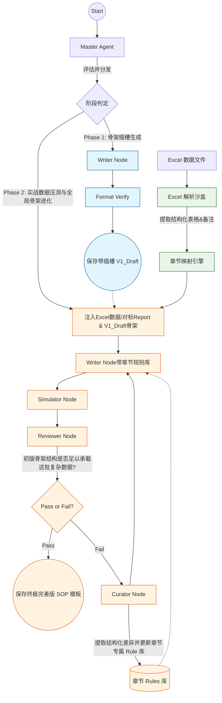

# 两阶段 SOP 生成系统架构设计方案

基于您对整个项目的构思，现有的单轨、统一迭代模式将升级为**“两阶段、多数据源、细粒度规则进化”**的全新架构。系统将清晰地分为**“阶段一：基础架构生成（无迭代）”**和**“阶段二：数据驱动的迭代进化（引入Excel与章节级规则）”**。

以下是详尽的架构与实现方案设计：

---

## 1. 系统核心理念演进

1. **从“通用全局修正”到“章节级专家”**：抛弃用一个万能 [writer_skill](file:///Users/pangshasha/Documents/github/glp_generate-sop/sop_deeplang/memory_manager.py#171-255) 应对所有错误的做法。全局Skill只负责如语气、Markdown格式等“通用底层逻辑”，而新增**章节级规则库（Chapter-specific Rule Library）**来处理各个章节特有的业务逻辑。
2. **安全隔离的Excel解析**：Excel解析模块以“沙盒函数（Sandbox）”形式存在，独立于核心LLM链路。它纯代码驱动，只负责输出结构化的数据（Markdown表格、JSON片段），避免核心链路受外部格式不稳定影响。
3. **两阶段解耦**：第一遍全凭经验“盲写”出附带占位符的雏形骨架，第二遍接入真实的极度复杂的 Excel 检验数据，对其进行结构“压力测试”以倒逼规则进化，最终产出无懈可击的终极泛化模板。

---

## 2. 阶段一：形式导向的基础 SOP 生成（Phase 1 - Form-Oriented Baseline）

**核心思想**：“重结构与形式，轻具体数值准确性”。第一阶段的任务并非直接产出一份数据绝对精确的终稿，而是利用大模型强大的语言泛化能力，快速搭建出结构合规、话术标准的**带有插槽（Placeholder）的骨架 SOP**。

**目标**：输出一份具备标准行文风格和清晰插槽标记的形式合格初稿。例如生成：*“本验证的目的是验证[分析方法名称]测定[基质类型]中[待测物名称]的浓度测定方法...以支持[验证用途]。”*。这种输出模式极大降低了 LLM 在面对具有歧义、部分缺失或过度复杂的上下文时“强行瞎编数据（幻觉）”的风险。
**特点**：**去幻觉压力、插槽化生成、单次线性执行（无迭代）。**

### 阶段一执行流精简重塑

1.  **输入界限**：仅向底层供给核心的 `protocol_content` 和原始结构化的 `report_content`。刻意屏蔽极易干扰初稿构建的细小数值特征和外部 Excel 表格。
2.  **泛化模板构建 (Writer Node)**：
    *   Writer 承担“SOP 结构提取师”的角色。
    *   当上下文中包含极其明确且唯一的元级别参数时（如验证机构全称），直接提取写入。
    *   **强制插槽制**：遇到具有不确定性、来自深层计算衍生（如平均提取回收率、具体仪器批号等）或上下文中未提及的具体信息时，Writer **不得擅自揣测和编造**，必须使用规范占位符（如 `[具体的精密度限度区间]`、`[进样器温度的准确数值]`）进行插槽标识。
3.  **极简的格式放行 (Format Verify Node)**：
    *   此时完全跳过盲测的 `Simulator` 及专门抠细节数据的 `Reviewer` 和 `Curator` 迭代链路。
    *   **Phase 1 的合格即为放行**：审阅节点只校验“版式、大纲是否对应”、“语言风格是否严谨”、“未能识别的数据是否合规地使用了 `[XXX]` 占位符”。以上只要合规，第一轮的 SOP 即算合格流转。
4.  **最终产物**：**Phase 1 基础 SOP 泛化模板（带数值插槽的骨架草稿）。**

---

## 3. 阶段二：数据盲测与骨架进化（Phase 2 - Stress-Test & Template Evolution）

**目标**：利用更多历史成功报告、方案以及**实际经过清洗的对应检测数据（Excel）**，对“阶段一生成的骨架草稿”进行**压力测试（Stress Test）**。发现初稿在面对复杂真实数据时的结构性缺漏，并提炼为“永久适用的章节书写规则”，最终倒逼出一份**极具鲁棒性的完美泛化模板**。
**特点**：**强迭代、沙盒盲测驱动，最终产物永远且只有一份（升级版且带插槽的 SOP 模板）。**

### 3.1 Excel 解析沙盒 (Excel Parsing Sandbox)
我们将之前验证过的 Excel 提取逻辑封装为一个独立、安全的函数库，该沙盒的职责为：
*   **输入**：包含二次数据汇总的 Excel 文件。
*   **处理**：拆分处理不同的 Sheet，进行表格切割和备注提取（如前文测试成功的逻辑）。
*   **映射（Mapping）**：将 Sheet 名与 SOP 章节名进行语义映射（可基于正则、关键词映射，或借助一个极小的 LLM 路由判定）。比如 `表2_系统适用性` -> 映射到SOP的 `系统适用性` 章节。
*   **输出**：为每个 SOP 章节提供对应的**结构化真实数据上下文**。

### 3.2 章节级规则库 (Chapter-specific Rule Library)
每个章节维护自己专属的知识库（例如：`memory/rules/章节名_rules.json`）。
*   **数据结构**：
    ```json
    {
       "section_name": "精密度",
       "rules": [
           {
               "id": "rule_1",
               "content": "精密度章节必须将批内CV%和批间CV%分开描述，并分别留出独立的插槽。",
               "source": "从NS25318BV01报告的Excel结构差异中进化得到",
               "version": "1.0"
           }
       ]
    }
    ```
*   **更新机制**：当系统处理到特定章节，且该章节的结果存在真实Excel数据特征时进入优化逻辑。

### 3.3 全新 Simulator、Reviewer 与 Curator 节点逻辑
**在第二阶段，审核链路的核心使命是“宏微观双层健壮度核验”；Curator 的核心使命是“提取经验，沉淀为架构规则”。**
*   **沙盘推演 (Simulator) 的双轨盲测**：
    1. **微观压测（新增点）**：拿着真实的 Excel 数据去强行代入骨架的插槽。如果发现槽位缺失或维度不足（如缺了溶血试验的分支表），抛出“结构缺失隐患”。
    2. **宏观流程黑箱（保留您的核心预设）**：拿着这本骨架 SOP 尝试脱离上下文“盲写”出一份完整的各节点实验报告。如果由于 SOP 描述模糊，导致系统“盲写”出的报告与“真实的对标报告（Report）”在工艺思路上有重大断裂或遗漏，立刻抛出“流程规范隐患”。
*   **双层核验 (Reviewer)**：基于 Simulator 在推演中碰壁的报告，无论是“插槽装不下数据”还是“SOP指导不出正确工艺”，Reviewer 确认无误后皆予以打回。
*   **规则提炼 (Curator)**：Curator 接收 Failure Cause，将报错转化为具体的**结构建设或流程修补指令**，更新至章节专属的 `rules.json`。

### 3.4 改进后的 Writer 节点（骨架重铸）
在阶段二的迭代中，Writer 拿到 Prompt 模型将发生如下变化：

```text
【系统角色与全局技能 (Global Skill)】
(加载原始的 writer_skill.md，重点强调：你的任务是排版更精密的插槽，绝非强行填入死数据！)

【当前章节专属规则 (Chapter Rules)】
(自动加载本章节专属的 rules.json，仅在当前章节生效)
- 规则1：必须补充对批内/批间的拆分描述插槽...
- 规则2：如果有溶血数据分支，必须单独列表...

【输入参考资料】
- 阶段一产出的骨架 SOP (带 [XXX] 插槽的 Phase 1 Draft)
- 沙盒解析的Excel表格结构 (用来测试结构的 Excel Sandboxed Data)

【请根据最新追加的规则与参照的复杂数据结构，对原始骨架 SOP 进行升维重装。确保你的新版骨架预留了足够细致的插槽来应对这类复杂数据：...】
```

---

## 4. LangGraph 工作流架构图 (Mermaid)



---

## 5. 项目重构实施步骤建议

如果您认可此方案，建议我们分接下来的 **4 个核心步骤** 落实：

**Step 1: 搭建 Excel 沙盒及映射层**
*   将刚才的 python 测试脚本提炼为一个纯净的 `ExcelParser_Sandbox` 类。使其接受参数后能返回：`{"表名/关键词": "Markdown内容"}`的字典格式。

**Step 2: 重构 MemoryManager 支持章节级规则库**
*   在 `memory` 目录下创建 `chapter_rules/` 文件夹。
*   提供轻量方法 `load_chapter_rule(section_title)` 和 `update_chapter_rule(section_title, new_rule)`。

**Step 3: 拆分阶段逻辑 (Phase 1 vs Phase 2)**
*   在 `main.py` 及 `Master` 中加入 `phase` 参数（`phase=1` 或 `phase=2`）。
*    Phase 1 剥离 Reviewer-Curator 循环，输出带 `[XXX]` 的初始泛化骨架。
*    Phase 2 将 Phase 1 的输出结构与解析出的 Excel 数据一并送入后续工作流作为压测底材。

**Step 4: 改造 Simulator、Reviewer、Curator 和 Writer**
*   `Simulator` 保留原本的“SOP 黑箱生成报告”的宏观测试功能；并新增“假想代入”职能：拿着沙盒解析出的真实的 Excel 数据去试装插槽，双轨并行侦测隐患。
*   `Reviewer` 修改裁决标准：基于 Simulator 盲测的“宏观步骤丢失”和“微观插槽装载失败”两本账，进行二次确认，直接打回骨架。
*   `Curator` 专职负责将上面被打回的“槽位缺失/逻辑遗漏”提炼为该章节的规则约束（如：必须增设批内批间区分插槽、必须单独列表体现溶血试验）。
*   `Writer` 被要求：读取新规则，根据真实的复杂性维度，在此前骨架的基础上，排版出防线更严密、考量更周全的插槽网络。不写死任何具体测试数值，只输出最极致的标准化大厂模板。

在这个架构下，整个系统最终只会输出**唯一的一份文档**（极富生命力的专属 SOP 编写专家直觉模板）。前期数据越刁钻，系统吐出来的插槽化模板就越无懈可击！

---

## 6. 系统复用与最终资源包形态 (Extracted Resource Pack)

为了保证“AI 能力层”与“业务产物层”的绝对隔离，系统沉淀出的知识将被解耦为一个可跨项目复用的**GLP SOP 智能生成资源包**。这纠正了“将 SOP 存放于 Skill 中”的概念混淆。其标准物理存放结构如下：

```text
sop_resource_pack/                 # 沉淀的核心数字资产包（解耦、可跨项目重用）
│
├── 1_memory_skills/               # 【大脑指导层】(控制各个 Agent 节点的常驻思维框架)
│   ├── master_skill.md            # Master 统筹指令 (规划架构与阶段分发)
│   ├── writer_skill.md            # Writer 写作底座 (严谨制药语气、Markdown 格式、插槽制铁律)
│   ├── simulator_skill.md         # Simulator 盲测规则 (强制扮演执行人员去尝试代入 Excel 数据挖掘槽位隐患)
│   ├── review_skill.md            # Reviewer 审核底线 (判断 SOP 骨架是否兜得住真实数据变体)
│   └── curator_skill.md           # Curator 提炼法则 (如何把 Failure Cause 转化成高质量的 rules.json)
│
├── 2_chapter_rules/               # 【局部经验层】(系统通过 Phase 2 不断自我迭代、越积越厚的无价之宝)
│   ├── rule_系统适用性.json       # "记得从表2里取 CV%、提取回收率要提公式..."
│   ├── rule_批内批间精密度.json   # "高、中、低浓度必须按表格顺序成组列出，且插槽分为批内/批间..."
│   └── rule_稳定性.json           # "冻融循环次数必须严格比对..."
│
├── 3_sandbox_scripts/             # 【工具链层】(纯代码驱动的确定性动作)
│   ├── excel_parser.py            # 处理合并单元格、提取表格备注的硬编码逻辑
│   └── table_mapper.py            # 智能映射 Excel Sheet 与对应 SOP 章节的脚本
│
└── 4_sop_template/                # 【终极交付物】(系统针对当前项目产出的那一本泛化规程)
    └── 泛化标准化_SOP模板.md          # 唯一的产品：经过真实数据压测与结构重组后，插槽体系无懈可击的那座“精装样板房”
```

**架构设计意义**：
在此绝对解耦的结构下，`1_memory_skills` 和 `2_chapter_rules` 构成了药企内部的**数字防差错工艺库**。这意味着即使未来更换了全新的大模型基座或测试项目，只要继承这组 Rules，系统便能以压倒性的效率，瞬间产出最高法务质量标准的那份唯一 SOP 模板。

### 📌 核心辨析：章节 Rules vs 带插槽泛化 SOP

为了防止在理解系统输出时产生混淆，必须严格区分以下两个由流水线（尤其是 Phase 2）产出的核心概念：

| 维度 | 章节 Rules (`2_chapter_rules/*.json`) | 唯一交付的带插槽 SOP 模板 (`4_sop_template/*.md`) |
| :--- | :--- | :--- |
| **本质定位** | **AI 的内部记忆与行为准则（“教 AI 怎么写”）**。它是大模型的行动指令代码。 | **业务侧的终极交付物（“AI 吐出来的实际文档”）**。供人类操作员直接打印阅读与使用。 |
| **内容形态** | 纯粹的逻辑和结构化约束。例如：“精密度章节必须区分批内/批间”。 | 具体的行文结构、专业话术和海量 `[XXX]`。例如：“本实验考察了[批内精密度%，n=xx]...” |
| **产生时机** | 完全诞生于 **Phase 2（第二阶段）** 的真实数据压测与结构防线崩溃重组期。 | **流水线的唯一物理归宿**。Phase 1 搭基本框架，Phase 2 吸收 Rules 升维重塑出终局形态。 |
| **交互对象** | **绝对隔离，仅供系统内部的 Writer 节点解析**，指导其下笔。 | **普通人类审核员或外部法务系统**，无脑替换 `[XXX]` 即可合规生效。 |

换言之：**Rules 是看不见的建筑图纸，泛化 SOP 模板是看得见的精装样板房。** Phase 2 就像一个严苛的质检员，通过拿着真实的 Excel 数据去挑刺，逼迫系统不断沉淀底层的 Rules（图纸），并最终倒逼出一份毫无破绽的那唯一一份泛化 SOP 模板（样板房）。
