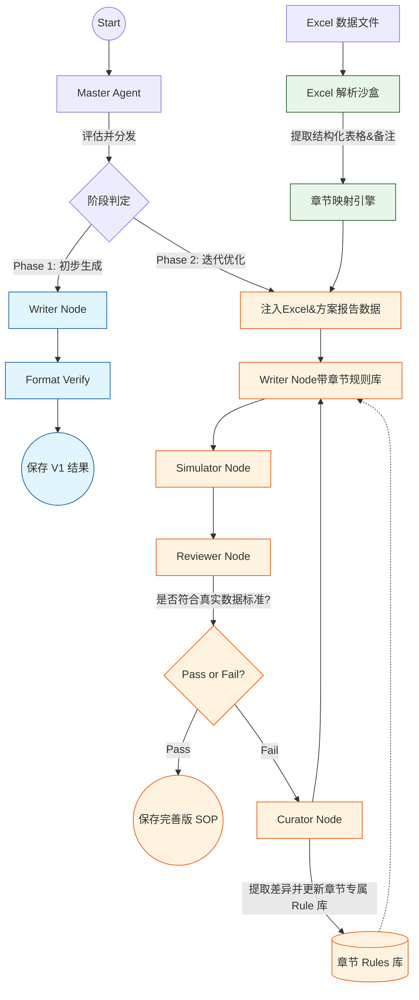

# 两阶段 SOP 生成系统架构设计方案

基于您对整个项目的构思，现有的单轨、统一迭代模式将升级为**“两阶段、多数据源、细粒度规则进化”**的全新架构。系统将清晰地分为**“阶段一：基础架构生成（无迭代）”**和**“阶段二：数据驱动的迭代进化（引入Excel与章节级规则）”**。

以下是详尽的架构与实现方案设计：

---

## 1. 系统核心理念演进

1. **从“通用全局修正”到“章节级专家”**：抛弃用一个万能 [writer_skill](file:///Users/pangshasha/Documents/github/glp_generate-sop/sop_deeplang/memory_manager.py#171-255) 应对所有错误的做法。全局Skill只负责如语气、Markdown格式等“通用底层逻辑”，而新增**章节级规则库（Chapter-specific Rule Library）**来处理各个章节特有的业务逻辑。
2. **安全隔离的Excel解析**：Excel解析模块以“沙盒函数（Sandbox）”形式存在，独立于核心LLM链路。它纯代码驱动，只负责输出结构化的数据（Markdown表格、JSON片段），避免核心链路受外部格式不稳定影响。
3. **两阶段解耦**：第一遍通过文本生成草稿，第二遍及以后通过“对比真实分析结果”来总结规律。

---

## 2. 阶段一：基础 SOP 生成（Phase 1 - Baseline Pass）

**目标**：快速且低成本地基于《验证方案》和《报告文本》搭建出第一版初稿 SOP。
**特点**：**不进入迭代循环**，单次线性执行。

*   **输入信息**：仅使用 `protocol_content` 和原始 `report_content`。屏蔽外部Excel和复杂的反馈修正。
*   **路由决策**：跳过复杂的 `Simulator` 和 `Curator` 迭代。
*   **执行流**：
    1.  **Master** 规划提纲和评估基础复杂度。
    2.  **Writer** 使用核心 Skill进行首次续写（生成 V1 版 SOP）。
    3.  **Reviewer/Format Verify** 仅进行格式对齐和合规性校验。
    4.  输出：**Phase 1 基础 SOP 模板**。

---

## 3. 阶段二：数据驱动与规则迭代（Phase 2 - Data-Driven Enhancement）

**目标**：利用更多历史成功报告、方案以及**实际检测的数据（Excel）**，发现初稿的不足，并提炼为“永久适用的章节书写规则”。
**特点**：强迭代、高度可扩展，Curator的定位转变为“章节规则提炼师”。

### 3.1 Excel 解析沙盒 (Excel Parsing Sandbox)
我们将之前验证过的 Excel 提取逻辑封装为一个独立、安全的函数库，该沙盒的职责为：
*   **输入**：包含二次数据汇总的 Excel 文件。
*   **处理**：拆分处理不同的 Sheet，进行表格切割和备注提取（如前文测试成功的逻辑）。
*   **映射（Mapping）**：将 Sheet 名与 SOP 章节名进行语义映射（可基于正则、关键词映射，或借助一个极小的 LLM 路由判定）。比如 `表2_系统适用性` -> 映射到SOP的 `系统适用性` 章节。
*   **输出**：为每个 SOP 章节提供对应的**结构化真实数据上下文**。

### 3.2 章节级规则库 (Chapter-specific Rule Library)
每个章节维护自己专属的知识库（例如：`memory/rules/章节名_rules.json`）。
*   **数据结构**：
    ```json
    {
       "section_name": "系统适用性",
       "rules": [
           {
               "id": "rule_1",
               "content": "表格下方必须包含 CV(%) 的计算公式或接受标准备注",
               "source": "从NS25318BV01报告的Excel备注中学习得到",
               "version": "1.0"
           }
       ]
    }
    ```
*   **更新机制**：当系统处理到特定章节，且该章节的结果存在真实Excel数据特征时进入优化逻辑。

### 3.3 全新 Curator 节点逻辑
**在第二阶段，Curator 的核心使命是“提取经验，沉淀为规则”。**
*   当系统将“Phase 1 生成的 SOP”、“报告内容”、“Excel 解析出的该章节真实表格数据”一起交给 Reviewer 取审阅时，如果发现生成 SOP 没有涵盖真实报表中的特定列或特定备注（如残留评估计算方式、干扰计算阈值等）。
*   Reviewer打回并在 Failure Cause 中说明。
*   **Curator 介入**：接收 Failure Cause，生成具体的**更新规则指令**，但是这次**只更该章节的 rules.json**。不再去动原本的庞大 `writer_skill.md`。

### 3.4 改进后的 Writer 节点
在后续的生成或迭代中，Writer 拿到 Prompt 模型将发生如下变化：

```text
【系统角色与全局技能 (Global Skill)】
(加载原始的 writer_skill.md，保持通用指导)

【当前章节专属规则 (Chapter Rules)】
(自动加载本章节专属的 rules.json，仅在当前章节生效)
- 规则1：必须保证表格表头具有“保留时间”...
- 规则2：如果有溶血数据，必须单独列表...

【输入参考资料】
- 原始方案 (Protocol)
- 对标报告 (Report)
- 沙盒解析的Excel表格结构 (Excel Sandboxed Data)

【请根据以上规则融合资料，生成本章内容的 SOP：...】
```

---

## 4. LangGraph 工作流架构图 (Mermaid)



---

## 5. 项目重构实施步骤建议

如果您认可此方案，建议我们分接下来的 **个步骤** 落实：

**Step 1: 搭建 Excel 沙盒及映射层**
*   将刚才的 python 测试脚本提炼为一个纯净的 `ExcelParser_Sandbox` 类。使其接受参数后能返回：`{"表名/关键词": "Markdown内容"}`的字典格式。

**Step 2: 重构 MemoryManager 支持章节级规则库**
*   在 `memory` 目录下创建 `chapter_rules/` 文件夹。
*   提供轻量方法 `load_chapter_rule(section_title)` 和 `update_chapter_rule(section_title, new_rule)`。

**Step 3: 拆分阶段逻辑 (Phase 1 vs Phase 2)**
*   在 [main.py](file:///Users/pangshasha/Documents/github/glp_generate-sop/sop_deeplang/main.py) 及 [Master](file:///Users/pangshasha/Documents/github/glp_generate-sop/sop_deeplang/nodes/master.py#34-156) 中加入 `phase` 参数（`phase=1` 或 `phase=2`）。
*    Phase 1 剥离 Reviewer-Curator 循环。
*    Phase 2 接入 Excel 真实数据进行 Review 的比对。

**Step 4: 改造 Curator 和 Writer**
*   `Curator` 仅对专属此章节的错误发号施令，调用 `update_chapter_rule` 记忆。
*   [Writer](file:///Users/pangshasha/Documents/github/glp_generate-sop/sop_deeplang/nodes/writer.py#13-114) 构建 prompt 时，除了基础技能外，拼接本章节特殊的 rules。

在这个架构下，整个系统不仅能从初期的方案无脑生成基础SOP，后期随着您投喂的报告和真实运行的 Excel 越多，特定章节的“本地规则库”就会越来越充实，形成极具价值的领域专属 SOP 编写专家直觉。
