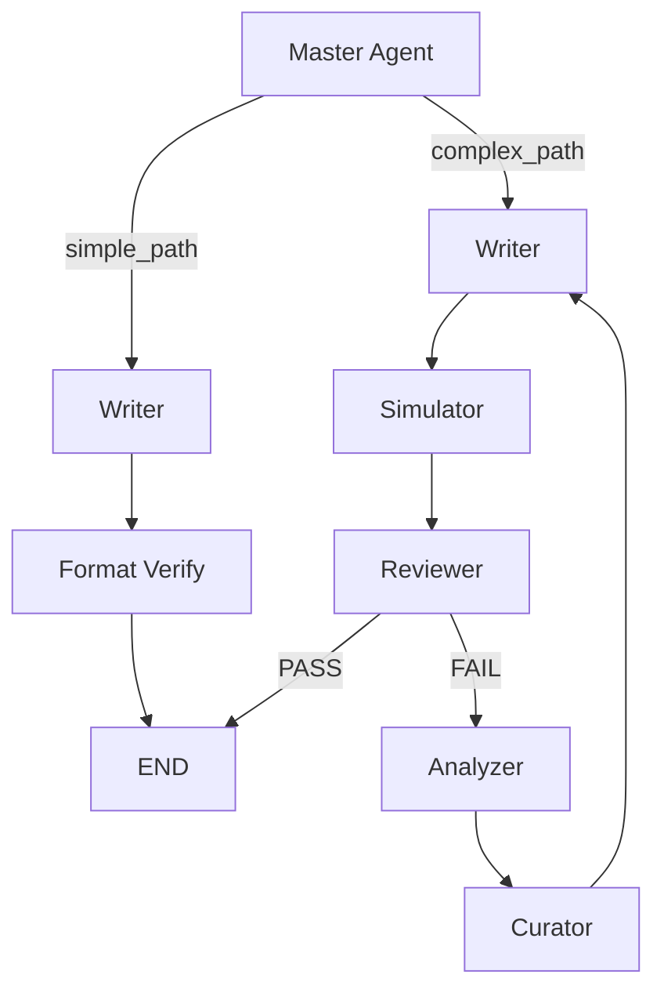

# SOP 生成系统 V6 - DeepLang

基于 LangGraph 的多模型 SOP 自动生成系统

## 🎯 系统概述

**V6 DeepLang** 是一个基于 LangGraph 工作流引擎的智能 SOP（标准操作程序）生成系统，采用多模型协作架构：

- **LangGraph**: 工作流编排引擎
- **Grok 4.1 Fast Reasoning**: Master/Simulator/Reviewer/Curator/Analyzer
- **Gemini 3.1 Flash Lite**: Writer（快速且经济）

### 核心特性

- ✅ **真正的 AI Agent 控制**：Master Agent 使用 Grok 和专属 Skill 进行上下文复杂度分析
- ✅ **Skill 驱动架构**：所有节点基于动态维护的 .md 技能库
- ✅ **进化闭环**：失败自动分析和学习，由 Curator 自动更新 Writer 技能库
- ✅ **三层记忆系统**：动态 Skill 库、静态模板库、历史审计日志库
- ✅ **统一命名与结构化数据**：清晰整合前置数据源，提供精准的上下文切片
- ✅ **干净输出**：脚本严格过滤控制节点输出，存储整洁

## 📁 项目结构

```text
sop_deeplang/
├── main_v6.py                      # LangGraph 主程序
├── config_v6.py                    # 配置（API Keys/模型/控制参数）
├── memory_manager_v6.py            # 记忆管理器（Skill / Template / Log）
├── integrate_data.py               # 数据整合预处理脚本
├── requirements.txt                # 依赖包
├── .env.example                    # 环境变量示例
├── nodes/                          # LangGraph 节点
│   ├── master.py                   # Master Agent 节点（AI 复杂度评估）
│   ├── writer.py                   # Writer 节点（SOP 生成）
│   ├── simulator.py                # Simulator 节点（盲测执行）
│   ├── reviewer.py                 # Reviewer 节点（质量审核）
│   ├── analyzer.py                 # Analyzer 节点（失败分析）
│   └── curator.py                  # Curator 节点（技能更新）
├── memory/                         # 记忆库
│   ├── skills/                     # Skill 库（动态维护）
│   │   ├── master/                 # Master Skill (复杂度分析标准)
│   │   ├── writing/                # Writer Skill (生成原则)
│   │   ├── simulation/             # Simulator Skill (盲测规则)
│   │   ├── evaluation/             # Reviewer Skill (审核清单)
│   │   ├── analysis/               # Analyzer Skill (根因分析)
│   │   └── curation/               # Curator Skill (更新规则)
│   ├── sop_templates/              # 最终产物：通过审核的 SOP
│   └── audit_logs/                 # 审计日志
└── mockData/                       # 外部测试数据存放路径
```

## 🚀 快速开始

### 1. 安装依赖

```bash
cd sop_deeplang
pip install -r requirements.txt
```

### 2. 配置环境变量

```bash
cp .env.example .env
```

编辑 `.env` 文件，填入你的 API 配置：

```env
# Grok API（通过 OpenAI 兼容接口）
OPENAI_API_KEY=your_grok_api_key
OPENAI_BASE_URL=https://api.openai.com/v1

# Gemini API
GEMINI_API_KEY=your_gemini_api_key
```

### 3. 数据预处理（如需）

系统目前直接加载整合后的数据 `integrated_data.json`：
```bash
python integrate_data.py
```
*备注：执行后将根据原始协议与报告在对应 `mockData` 目录下生成 `integrated_data.json`。*

### 4. 运行系统

```bash
python main_v6.py
```

## 📊 工作流程

### 复杂度评估（Master Agent）

通过 Grok + Master Skill 对当前章节内容进行动态复杂度分析：

- **简单章节（Simple）**：信息明确、逻辑直接的章节 → `simple_path`
- **复杂章节（Complex）**：涉及深入计算、专业数据论证或不确定性步骤的章节 → `complex_path`

### 路由决策



## 🧠 Skill 驱动架构

### Skill 库管理

所有核心认知逻辑（Skills）以 `.md` 文件存储在 `memory/skills/` 各自的分类目录中：

1. **统一驱动**：所有 Agent 节点均受到其专属 Skill 的引导和校准
2. **读写分离机制**：人类可读、可直接通过编辑 `.md` 进行干预
3. **自进化更新**：Curator 能够根据审核反馈自动更新 Writer Skill
4. **版本控制追踪**：每次更新自动生成新版本（v1.0 → v1.1 → ...）

## 💾 记忆管理

### 三层动态与静态记忆库

1. **Skill 库** (`memory/skills/`)
   - 具有生命力和进化能力的组件
   - System Prompts 与校验规则的持久化形态

2. **模板库** (`memory/sop_templates/`)
   - 最终验证过的 SOP 产物，支持 `.md` 和 `.json` 双格式输出
   - 高分确认，即可直接用作最终模板

3. **审计日志库** (`memory/audit_logs/`)
   - 存放于按日期归档的历史流水中（如：`audit_2026-03-18.jsonl`）
   - JSON 结构化留存关键轨迹和执行指标

## 📝 结构化输入数据

引入了全新的整合数据模型：系统将前置方案 (`protocol_content`) 和历史报告 (`report_content`) 切片对齐到具体章节下，允许 AI 高效抓取对应上下文。

```json
{
  "datasets": [
    {
      "dataset_id": 1,
      "protocol_content": "完整验证方案文本",
      "report_content": "完整GLP报告文本",
      "sections": [
        {
          "section_title": "方法学验证",
          "protocol_context": "...（切片上文）...",
          "report_context": "...（切片下文）..."
        }
      ]
    }
  ]
}
```

## 🔧 配置调整

编辑 `config_v6.py` 修改系统策略：

```python
# 数据处理深度控制
MAX_DATASETS = 1  # 运行的数据集数量

# 最大迭代次数（防止死循环）
MAX_ITERATIONS = 3

# 模型调配组合
MASTER_MODEL = "grok-4-1-fast-reasoning"
WRITER_MODEL = "gemini-3.1-flash-lite"
SIMULATOR_MODEL = "grok-4-1-fast-reasoning"
REVIEWER_MODEL = "grok-4-1-fast-reasoning"
ANALYZER_MODEL = "grok-4-1-fast-reasoning"
CURATOR_MODEL = "grok-4-1-fast-reasoning"
```

## 🎯 设计迭代优势 (对比 V5)

1. **重构 Master**：由生硬规则转向基于 Skill 的高灵敏度 Agent 判决。
2. **简化流转架构**：削减了中度混合路径，优化为 `Simple/Complex` 二元判决。
3. **明确意图边界**：将参数和内容变量词条如 `original_content` 切实打标为 `protocol_content` 消除语义混淆。
4. **输出精炼化**：LangGraph 通道中的有效信息将被裁剪记录以维持清晰。

## 🐛 故障排查

### 问题：API 调用失败或响应异常

```bash
# 检查 API Key 配置映射
cat .env
# Grok 调用受阻确认 OPENAI_BASE_URL 指定是否正确
```

### 问题：LangGraph 依赖或工作流阻滞

```bash
# 拉取/重新校准依赖版本
pip install -r requirements.txt --upgrade
```

## 📄 License

MIT
