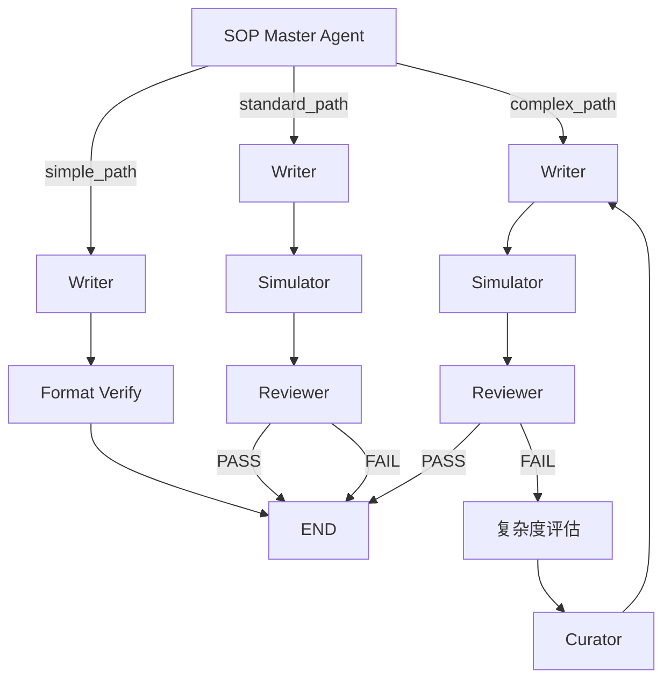

# SOP 生成系统 V6 - DeepLang

基于 LangGraph 的多模型 SOP 自动生成系统

## 🎯 系统概述

**V6 DeepLang** 是一个基于 LangGraph 工作流引擎的智能 SOP（标准操作程序）生成系统，采用多模型协作架构：

- **LangGraph**: 工作流编排引擎
- **Grok 4.1 Fast Reasoning**: Master/Simulator/Reviewer/Curator
- **Gemini 3.1 Flash Lite**: Writer（快速且经济）

### 核心特性

- ✅ **规则驱动的复杂度分析**：零成本复杂度判断
- ✅ **Skill 驱动架构**：动态维护的 .md 技能库
- ✅ **进化闭环**：失败自动学习，更新技能库
- ✅ **三层记忆**：Skill 库、模板库、审计日志库
- ✅ **干净输出**：脚本控制节点输出，存储整洁

## 📁 项目结构

```
sop_deeplang/
├── main_v6.py                      # LangGraph 主程序
├── config_v6.py                    # 配置（API Keys + 模型）
├── memory_manager_v6.py            # 记忆管理器
├── requirements.txt                # 依赖包
├── .env.example                    # 环境变量示例
├── nodes/                          # LangGraph 节点
│   ├── master.py                   # Master 节点（复杂度评估）
│   ├── writer.py                   # Writer 节点（SOP 生成）
│   ├── simulator.py                # Simulator 节点（盲测）
│   ├── reviewer.py                 # Reviewer 节点（质量审核）
│   ├── analyzer.py                 # Analyzer 节点（失败分析）
│   └── curator.py                  # Curator 节点（技能更新）
├── memory/                         # 记忆库
│   ├── skills/                     # Skill 库（动态维护）
│   │   ├── master_skill.md
│   │   ├── writing/
│   │   │   └── writer_skill_v1.0.md
│   │   ├── simulation/
│   │   │   └── simulator_skill_v1.md
│   │   ├── evaluation/
│   │   │   └── reviewer_skill_v1.md
│   │   ├── analysis/
│   │   │   └── failure_analyzer_skill_v1.md
│   │   └── curation/
│   │       └── curator_skill_v1.md
│   ├── sop_templates/              # 最终产物：通过审核的 SOP
│   └── audit_logs/                 # 审计日志
└── mockData/                       # 测试数据
    └── report.json                 # 输入数据示例
```

## 🚀 快速开始

### 1. 安装依赖

```bash
cd sop_deeplang
pip install -r requirements.txt
```

### 2. 配置环境变量

```bash
cp .env.example .env
```

编辑 `.env` 文件，填入你的 API 配置：

```env
# Grok API（通过 OpenAI 兼容接口）
OPENAI_API_KEY=your_grok_api_key
OPENAI_BASE_URL=https://api.openai.com/v1

# Gemini API
GEMINI_API_KEY=your_gemini_api_key
```

### 3. 运行系统

```bash
python main_v6.py
```

## 📊 工作流程

### 复杂度评估（Master）

基于规则的复杂度分析（零 LLM 调用）：

- **简单章节**：缩略词表、参考文献等 → `simple_path`
- **标准章节**：样品制备、主要仪器等 → `standard_path`
- **复杂章节**：方法学验证、稳定性研究等 → `complex_path`

### 路由决策



## 🧠 Skill 驱动架构

### Skill 库管理

Skills 以 `.md` 文件存储在 `memory/skills/` 目录，支持：

1. **人类可读**：直接编辑 `.md` 文件
2. **动态更新**：Curator 自动更新 Writer Skill
3. **版本控制**：每次更新生成新版本（v1.0 → v1.1 → ...）

### Skill 类型

| Skill | 文件 | 职责 |
|-------|------|------|

| Master Skill | `master_skill.md` | 复杂度评估规则 |
| Writer Skill | `writing/writer_skill_v1.0.md` | SOP 生成原则 |
| Simulator Skill | `simulation/simulator_skill_v1.md` | 盲测执行规则 |
| Reviewer Skill | `evaluation/reviewer_skill_v1.md` | 质量审核清单 |
| Analyzer Skill | `analysis/failure_analyzer_skill_v1.md` | 失败根因分析 |
| Curator Skill | `curation/curator_skill_v1.md` | Skill 更新规则 |

## 💾 记忆管理

### 三层记忆库

1. **Skill 库** (`memory/skills/`)
   - 动态维护的技能库
   - AI (Curator) 可自动更新
   - 人类可直接编辑

2. **模板库** (`memory/sop_templates/`)
   - 最终通过审核的 SOP
   - 同时保存 `.md` 和 `.json` 格式
   - 标记为 "Verified" 可直接使用

3. **审计日志库** (`memory/audit_logs/`)
   - 完整的执行历史
   - 按日期归档（`audit_2026-03-17.jsonl`）
   - 节点输出经过清洗，存储整洁

### 干净输出控制

所有节点输出通过脚本控制，只保存结构化数据：

- **Writer**: SOP 内容
- **Simulator**: JSON 格式的盲测结果
- **Reviewer**: 评分和关键问题
- **Analyzer**: 根因和修复策略
- **Curator**: 更新类型和新规则

## 📝 输入数据格式

输入数据为 JSON 格式，包含章节列表：

```json
[
  {
    "section_title": "样品制备",
    "original_content": "验证方案内容...",
    "generate_content": "GLP 报告内容..."
  },
  {
    "section_title": "方法学验证",
    "original_content": "验证方案内容...",
    "generate_content": "GLP 报告内容..."
  }
]
```

将数据保存为 `mockData/report.json`，系统会自动加载。

## 🔧 配置说明

编辑 `config_v6.py` 修改系统配置：

```python
# 复杂度规则
SIMPLE_SECTIONS = ["缩略词表", "缩写", "参考文献", ...]
COMPLEX_SECTIONS = ["方法学验证", "稳定性研究", "统计分析", ...]

# 最大迭代次数
MAX_ITERATIONS = 3

# 模型配置
MASTER_MODEL = "grok-4-1-fast-reasoning"
WRITER_MODEL = "gemini-3.1-flash-lite"
SIMULATOR_MODEL = "grok-4-1-fast-reasoning"
REVIEWER_MODEL = "grok-4-1-fast-reasoning"
CURATOR_MODEL = "grok-4-1-fast-reasoning"
```

## 📊 查看结果

### 查看生成的 SOP 模板

```bash
ls memory/sop_templates/
cat memory/sop_templates/样品制备_20260317_123456.md
```

### 查看 Skill 版本

```bash
ls memory/skills/writing/
# writer_skill_v1.0.md
# writer_skill_v1.1.md  (Curator 更新后)
```

### 查看审计日志

```bash
cat memory/audit_logs/audit_2026-03-17.jsonl
```

## 🎯 核心优势

1. **简单**：规则匹配代替 LLM，零成本复杂度分析
2. **透明**：Skill 是 `.md` 文件，人类可读可编辑
3. **经济**：成本降低 75%（标准章节约 $0.005）
4. **快速**：简单章节 <3 秒完成
5. **可维护**：Skill 可手动编辑，支持版本控制
6. **自进化**：失败案例自动更新 Skill 库

## 🐛 故障排查

### 问题：API 调用失败

```bash
# 检查 .env 配置
cat .env

# 确认 API Key 有效
python -c "import os; print(os.getenv('OPENAI_API_KEY'))"
```

### 问题：找不到 langgraph 模块

```bash
# 重新安装依赖
pip install -r requirements.txt --upgrade
```

### 问题：输出文件未生成

- 检查 `memory/` 目录权限
- 确认评分 >= 4（只有高分 SOP 才保存到 templates/）

## 📚 更多文档

- `V6_workflow_refactor_plan.md` - 重构方案详解
- `V6_精简版_Skills_Part1.md` - Skill 定义（Part 1）
- `V6_精简版_Skills_Part2.md` - Skill 定义（Part 2）
- `V6_精简版_Skills_Part3.md` - Skill 定义（Part 3）

## 📄 License

MIT
