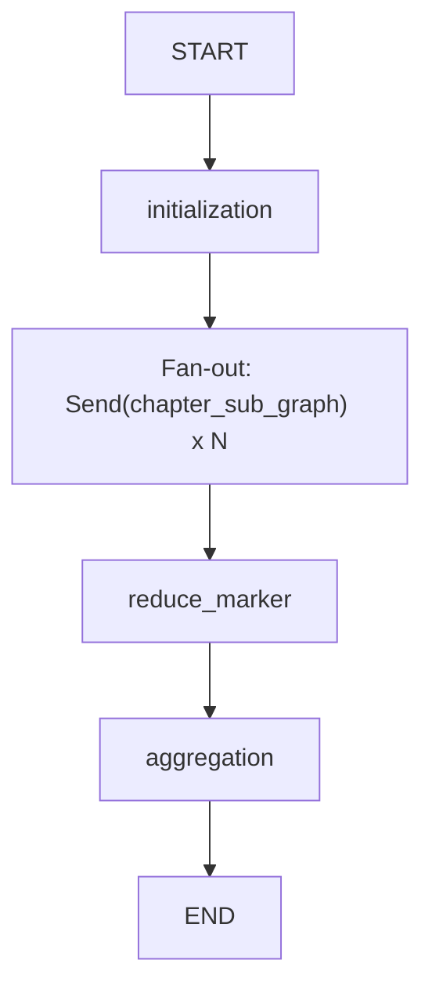

# SOP Generation 工作流流程说明（当前实现）

本文档描述 `src/workflows/sop_generation` 在当前代码中的真实执行流程与数据流转。

## 1. 目标

将输入章节数据并发处理，按章节生成 SOP，经过模拟执行与评审闭环后汇总，最终：

1. 输出 `completed_chapters` 聚合结果（JSON）到本地 `tests/output`

## 2. 数据源与入口

### 2.1 数据源（优先级）

- 优先读取：接口直传 `state.chapter_list`（来自 `POST /templates/sop_generation`）
- 兼容回退：`report_json_path` 指向的 JSON
- 默认回退：`mockData/report.json`
- 每个章节初始映射字段：
  - `section_title`
  - `original_content`（来自 `section_protocol` 或 `original_content`）
  - `target_generate_content`（来自 `section_report` 或 `generate_content`）
  - `retry_count=0`
  - `is_passed=False`
  - `status="RUNNING"`

### 2.2 主入口

- API 入口：`POST /templates/sop_generation`
- 初始状态最小字段：
  - `project_id`
  - `chapter_list`（接口直传）
  - `current_phase="initialization"`
  - `completed_chapters=[]`
  - `error_log=[]`

## 3. 状态结构（关键字段）

### 3.1 ChapterState（单章节）

- 输入/上下文：
  - `section_title`
  - `original_content`
  - `target_generate_content`
  - `feedback`（可选，重试时）
  - `current_sop`（可选）
  - `simulated_generate_content`（可选）
- 控制字段：
  - `retry_count`
  - `is_passed`
  - `status`: `RUNNING | PASSED | Need Human Review`
  - `sop_type`（可选）：`simple_insert | rule_template | complex_composite`

### 3.2 GlobalState（全局）

- 主字段：
  - `project_id`
  - `mapped_chapters`
  - `completed_chapters`
  - `error_log`
  - `current_phase`
- 聚合新增输出：
  - `completed_chapters_output_path`（本地 JSON 路径）

## 4. 主图流程



### 4.1 initialization

从 `chapter_list`（未提供则回退 JSON 文件）提取待处理章节，写入 `mapped_chapters`，并设置 `current_phase="fan_out"`。

### 4.2 Fan-out 并发

通过 LangGraph `Send` 将每个 `ChapterState` 并发发送到 `chapter_sub_graph`。

### 4.3 reduce_marker

作为 join barrier，等待所有章节子图完成，写 `current_phase="merge"`。

### 4.4 aggregation

聚合完成后执行以下输出动作：

1. 将 `completed_chapters` 落盘为 JSON 到 `tests/output`

## 5. 章节子图流程（Node 4 -> 6 -> 7）

```mermaid
flowchart TD
  S["START"] --> W["sop_writer"]
  W --> M["simulator (sanitized input)"]
  M --> R["reviewer"]
  R -->|is_passed=true| P["pass_exit (status=PASSED)"]
  R -->|is_passed=false and (retry_count + 1) < 3| C["retry_counter (+1)"]
  C --> W
  R -->|is_passed=false and (retry_count + 1) >= 3| H["failure_exit (status=Need Human Review)"]
  P --> E["END"]
  H --> E
```

### 5.1 Node 4: `sop_writer`

- 输入（首轮）：
  - `original_content`, `target_generate_content`, `status`, `is_passed`, `retry_count`
- 输入（重试）额外：
  - `feedback`, `current_sop`, `simulated_generate_content`
- 输出：
  - `current_sop`（固定三段格式）
  - `sop_type`

### 5.2 Node 6: `simulator`

- 关键约束：**禁止接收 `target_generate_content`**
- 图中通过包装函数先裁剪输入白名单，再调用 `simulator_node`
- 允许字段：
  - `section_title`, `original_content`, `current_sop`, `status`, `is_passed`, `retry_count`, `sop_type`
- 节点内部防线：
  - 如果输入含 `target_generate_content`，直接抛出 `ValueError`
- 输出：
  - `simulated_generate_content`

### 5.3 Node 7: `reviewer`

- 输入：
  - `target_generate_content`
  - `current_sop`
  - `simulated_generate_content`
  - `original_content`（用于防幻觉校验）
- 输出：
  - `is_passed`（bool）
  - `feedback`（string）

### 5.4 retry_counter

- 仅在 `is_passed=false` 且 `(retry_count + 1) < 3` 触发（总尝试上限 3 次，含首轮）
- 动作：
  - `retry_count += 1`
  - `status="RUNNING"`

## 6. 聚合输入/输出说明

### 6.1 reduce_marker 输入（常见）

- `current_phase`
- `mapped_chapters`
- `completed_chapters`
- `error_log`

### 6.2 aggregation 输入（常见）

- `project_id`
- `completed_chapters`

### 6.3 aggregation 输出

- `completed_chapters_output_path`
- `current_phase="completed"`

## 7. completed_chapters 落盘规则

- 目录：`tests/output`
- 文件名：`completed_chapters_{project_id}_{UTC时间戳}.json`
- 内容结构：
  - `project_id`
  - `generated_at_utc`
  - `chapter_count`
  - `completed_chapters`（完整章节结果数组）

## 8. 章节输出顺序

聚合结果中的章节顺序以 `completed_chapters` 的实际完成顺序为准。

## 9. 注意事项

1. 在 LangSmith Trace 中，你可能看到 `simulator` 图节点的上游 state 含 `target_generate_content`。  
   这不代表 `simulator_node` 实际消费了它，实际调用前有输入裁剪，且节点内有硬校验。
2. 若 `reviewer` 连续失败达到总尝试上限（3 次，含首轮；即重试最多 2 次），章节会被标记为 `Need Human Review`，但主流程仍继续聚合并产出结果。
