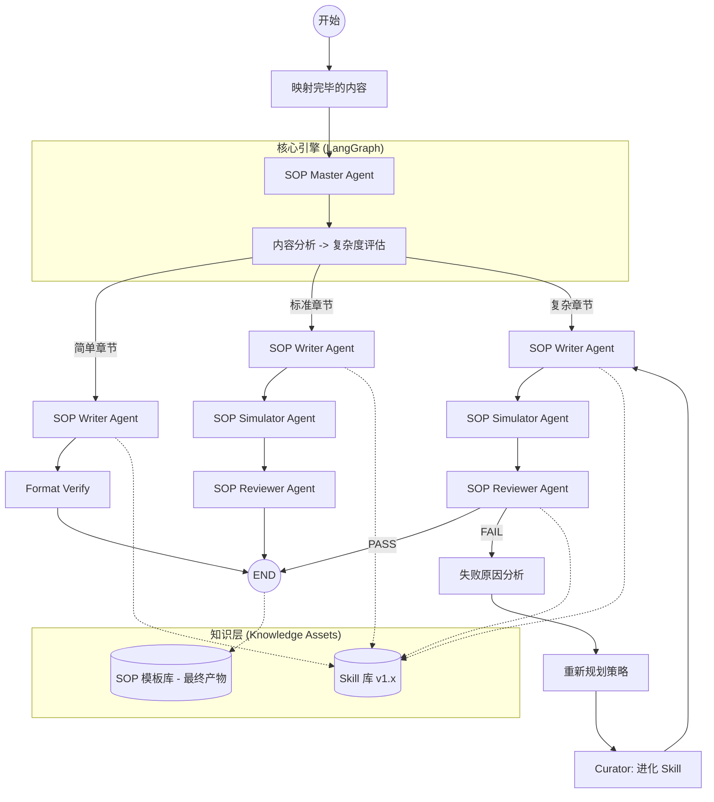

# SOP 系统 V6：基于工作流图的深度重构方案 (V2.1 - 架构简化版)

## 1. 系统架构工作流 (Mermaid)



---

## 2. 模型异构协作方案 (Grok + Gemini)

| 节点 | 推荐模型 | 核心职责 |
| :--- | :--- | :--- |
| **SOP Master** | **Grok 4.1 Fast Reasoning** | 全局编排、**复杂度自动评估**（通过提示词直判）。 |
| **SOP Writer** | **Gemini 3.1 Flash Lite** | 基于 Skill 模板的高速填充。 |
| **SOP Simulator**| **Grok 4.1 Fast Reasoning** | 执行盲测逻辑。 |
| **SOP Reviewer** | **Grok 4.1 Fast Reasoning** | 质量审计与打分。 |
| **Curator** | **Grok 4.1 Fast Reasoning** | 修改并重写 [.md](file:///d:/%E7%9B%8A%E8%AF%BA%E6%80%9D/sop%E7%94%9F%E6%88%90/README.md) 格式的 Skill 资产。 |

---

## 3. 核心机制

### 3.1 提示词驱动的复杂度分析
不再依赖外部知识库。`Master Agent` 利用 Grok 的推理能力，直接通过 Prompt 评估输入的方案和报告示例：
- **评估维度**：步骤数量、试剂种类、合规风险点、数据计算复杂度。
- **输出**：`simple` | `standard` | `complex`。

### 3.2 Skill 驱动架构 (Zero-Shot execution)
Writer 依靠外部 `writing_skill.md` 确定其行为边界，保证输出格式的绝对确定性。

### 3.3 进化闭环
触发 FAIL 后，`Failure Analyzer` 给出修复指令，`Curator` 固化为新版 Skill。

---

## 4. 目录结构预览
```text
sop_生成_deepagents/
├── main_v6.py                # LangGraph 核心图逻辑
├── subagents_config_v6.py     # Grok/Gemini 异构配置
├── memory/
│   ├── skills/               # 动态进化的 Skill 库 (.md)
│   │   ├── writing/
│   │   ├── evaluation/
│   │   └── simulation/
│   ├── sop_templates/        # 最终产物：通过审计的 SOP 模板 (.json/.md)
│   └── audit_logs/           # 每一轮进化的完整审计日志
```

## 5. 输出库管理
当流程走到 `END` (PASS) 时：
1. **持久化**：[MemoryManager](file:///d:/%E7%9B%8A%E8%AF%BA%E6%80%9D/sop%E7%94%9F%E6%88%90/sop_%E7%94%9F%E6%88%90_deepagents/memory_manager_v5.py#13-199) 将最终稿存入 `sop_templates/`。
2. **结构化**：同时保存 Markdown 预览版和用于后续生成的 JSON 结构化版本。
3. **版本标记**：标记该模板为“Verified”，可直接交付生产使用。

## 5. 实施步骤
1. **[Phase 1]**：建立 `memory/skills` 目录版本管理逻辑。
2. **[Phase 2]**：编写 V1.0 版本的 Master 和 Writer Skill 模板。
3. **[Phase 3]**：基于 LangGraph 开发分支路由（Complexity Router）。
4. **[Phase 4]**：压力测试：强制模拟一个失败章节，验证 Curator 是否成功更新了 Skill。
